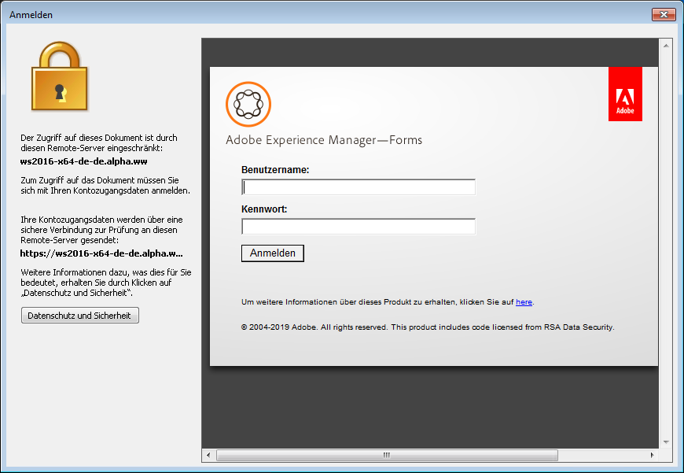

# Verwendung von AEM Document Security Extension für Microsoft Office{#using-aem-document-security-extension-for-microsoft-office}

## Schützen Sie Dateien mithilfe von AEM Document Security Extension {#usingaemdocumentsecurityextensiontoprotectfiles}

Sie können steuern, wie Empfänger Ihre richtliniengeschützten Dateien nutzen, und zwar unabhängig vom Ausmaß ihrer Verteilung.

Mit Dokument Security Extension for Microsoft Office können Sie folgende Aufgaben durchführen:

* Verbindung zu Dokument Security konfigurieren
* Richtlinie auf eine Datei anwenden
* Öffnen Sie die Dokument Security-Webseiten, um Benutzerrichtlinien zu erstellen und zu verwalten.
* Richtlinienschutz aus einer Datei entfernen
* Ändern der Richtlinie, die auf eine Datei angewendet wird
* Öffnen Sie die Dokument Security-Webseiten, um den Dateizugriff zu sperren oder die Dateirichtlinie zu ändern
* Öffnen Sie die Dokument Security-Webseiten, um den Prüfverlauf der Datei Ansicht

### Herstellen einer Verbindung zu einem Dokument-Sicherheitsserver {#connect-to-a-document-security-server}

Wenn Sie Richtlinien auf Dateien anwenden möchten, müssen Sie die Verbindungseinstellungen für Dokument Security konfigurieren. Abhängig davon, wie Dokument Security Extension for Microsoft Office installiert wurde, verfügen Sie eventuell bereits über Standardeinstellungen für die Verbindung. Sie können Verbindungseinstellungen für eine oder mehrere Instanzen von Dokument Security hinzufügen. Sie können Serverinformationen vom Dokument Security-Administrator abrufen.

Sie müssen den Server, den Sie zum Schutz von Dateien oder zum Verwalten der geschützten Dateien verwenden möchten, als Standardserver festlegen. Wenn Sie eine Richtlinie auf eine neue Datei anwenden oder die Dokument Security-Webseiten öffnen, stellt Dokument Security Extension for Microsoft Office eine Verbindung zum Standardserver her. Wenn Sie Dateien mit mehr als einer Instanz von Dokument Security schützen, müssen Sie die Standardservereinstellung beim Wechsel zwischen den Servern ändern. Sie können Dateien öffnen, die durch eine beliebige Instanz von Dokument Security geschützt sind, solange Sie berechtigt sind, die Datei zu öffnen.

Wenn Ihr Dokument Security-Server eine zertifikatbasierte Authentifizierung verwendet, müssen Sie das Zertifikat installieren, das Sie auf Ihrem lokalen Computer erhalten haben. Sie müssen die Zertifikatauthentifizierung auswählen und das Zertifikat bereitstellen, das Sie für die Authentifizierung verwenden möchten.

Nachdem Sie die Verbindungseinstellungen für eine Instanz von Dokument Security in einer Microsoft Office-Anwendung konfiguriert haben, ist diese für alle Word-, Excel- und PowerPoint-Anwendungen konfiguriert.

#### Installieren des clientseitigen Zertifikats {#install-the-client-side-certificate}

Wenn Sie über die Zertifikatauthentifizierung oder Zweiwegeauthentifizierung auf die Dokument Security-Webseiten zugreifen müssen, erhalten Sie das Zertifikat, das Sie auf Ihrem lokalen Computer installieren müssen. Sie erhalten eine Zertifikatdatei (.PFX- oder .P12-Datei) und das dazugehörige Kennwort.

1. Speichern Sie die Zertifikatdatei auf Ihrem lokalen Computer.
1. Klicken Sie bei gedrückter Dublette auf die Zertifikatdatei, um den Import-Assistent für das Zertifikat zu öffnen, und klicken Sie auf **Weiter**.
1. Klicken Sie auf **Weiter**, wenn die Zertifikatdatei im Feld &quot;Dateiname&quot;aufgeführt ist. Klicken Sie auf **Durchsuchen**, wenn Sie ein anderes Zertifikat suchen möchten.
1. Geben Sie das Kennwort ein, das Sie erhalten haben, und klicken Sie auf **Weiter**.
1. Wählen Sie im Dialogfeld &quot;Zertifikatspeicher&quot;die Option &quot;Alle Zertifikate im folgenden Store platzieren&quot;und klicken Sie auf **Durchsuchen**.
1. Wählen Sie im Dialogfeld &quot;Zertifikatspeicher auswählen&quot;die Option Persönlich, klicken Sie auf **OK**, klicken Sie auf **Weiter** und dann auf **Fertig stellen**.

#### Verbindungseinstellungen {#configure-connection-settings} konfigurieren

1. Wählen Sie in Document Security Extension for Microsoft , Office 2010, und Office 2013 auf der Registerkarte **Document Security** die Option **Server auswählen**.
1. Klicken Sie entweder auf **Neu**, um neue Verbindungseinstellungen zu erstellen, oder wählen Sie eine bestehende Verbindung aus und klicken Sie auf **Bearbeiten**.
1. Geben Sie im Feld **Name** einen Namen für die Verbindung ein. Sie können einen beliebigen Namen verwenden.
1. Geben Sie die Adresse des Servers in das Feld **Serveradresse** ein.
1. Geben Sie den Serveranschluss in das Feld **Port** ein.
1. (Optional) Wenn Sie Ihren Benutzernamen und Ihr Kennwort speichern möchten, wählen Sie **Kennwort auf diesem Computer speichern** und geben Sie Ihren Benutzernamen und Ihr Kennwort in die entsprechenden Felder ein. Es wird empfohlen, diese Option nicht auszuwählen, wenn andere Personen Zugriff auf den Computer haben.
1. Klicken Sie auf **Verbindung zu diesem Server herstellen**. Dokument Security Extension for Microsoft Office versucht, eine Verbindung mit dem angegebenen Server herzustellen. Führen Sie abhängig vom angegebenen Authentifizierungstyp einen der folgenden Schritte aus:

   **Benutzername und Kennwort**

   Geben Sie den vom Document Security-Administrator erhaltenen Benutzernamen und das Kennwort ein.

   **Zertifikatsauthentifizierung**

   Wählen Sie diese Option, um das Zertifikat auszuwählen, das Sie in Ihrem persönlichen Zertifikatspeicher erhalten und installiert haben.

   Wenn unter Dokument Security nur ein Authentifizierungstyp konfiguriert ist, wird nur diese Option angezeigt.

>[!NOTE]
>
>Wenn Sie keine Serververbindung herstellen können, versuchen Sie, die Dokument Security-Webseiten in Internet Explorer zu öffnen. Wenn Sie mit Internet Explorer keine Serververbindung herstellen können oder wenn in einem Dialogfeld eine Warnung zum Serverzertifikat angezeigt wird, kann Dokument Security Extension for Microsoft Office keine Serververbindung herstellen. Wenden Sie sich zwecks Hilfe an den Serveradministrator.

>[!NOTE]
>
>Wenn Sie keine Verbindung zu Dokument Security herstellen können, wird eine Meldung mit der Meldung angezeigt, dass der Benutzername und das Kennwort falsch sind. Bitte überprüfen Sie Ihre Konfigurationseinstellungen und versuchen Sie es erneut. Diese Meldung wird möglicherweise angezeigt, wenn Sie aus einem anderen Grund keine Verbindung herstellen können. Wenn Sie zum ersten Mal eine Verbindung zum Server herstellen, überprüfen Sie, ob Sie den Servernamen und Anschluss korrekt eingestellt haben.

#### Standardserver {#specify-the-default-server} angeben

1. Gehen Sie folgendermaßen vor:

   * Wählen Sie in Document Security Extension for Microsoft , Office 2010, und Office 2013 auf der Registerkarte **Document Security** die Option **Server auswählen**.

1. Wählen Sie einen Server aus, der als Standard festgelegt werden soll, und klicken Sie auf **Standard festlegen**. Neben dem Standardserver wird ein Stern angezeigt.

### Verwenden von Authentifizierungsanbietern von Drittanbietern {#using-third-party-authentication-providers}

Sie können externe Authentifizierungsanbieter in AEM Forms Document Security verwenden. Mit diesen Authentifizierungsanbieter können Sie zusätzliche Zugriffsebenen auf die geschützten Dokumente hinzufügen. AEM Forms Document Security unterstützt folgende erweiterte Authentifizierungsarbeitsabläufe:

* Erweiterter Authentifizierung mit AEM Forms Standard-URL
* Erweiterte Authentifizierung mit einer benutzerdefinierten URL
* Erweiterter Standardauthentifizierungsarbeitsabläufe mit Identitätsanbietern von Drittanbietern, die auf AEM Forms on JEE Server konfiguriert sind
* Erweiterter benutzerdefinierter Authentifizierungsarbeitsabläufe mit Identitätsanbietern von Drittanbietern, die auf AEM Forms on JEE Server konfiguriert sind
* Erweiterter Authentifizierung mit benutzerdefinierter Seite für die Auflistung von SAML-Authentifizierungen

#### Erweiterter Authentifizierung mit AEM Forms Standard-URL  {#extended-authentication-using-default-aem-forms-url}

Sie können die Standard-AEM Forms-URL für die erweiterte Authentifizierung verwenden. Die Standard-Startseite enthält das Adobe-Branding. Darüber hinaus werden Standardeinstellungen für AEM Forms verwendet, wenn die Standard-AEM Forms-URL für die erweiterte Authentifizierung verwendet wird.

Führen Sie zum Aktivieren der erweiterten Authentifizierung mit der standardmäßigen URL für die Adobe-Startseite folgende Schritte durch:

1. Öffnen Sie die AEM Forms Admin-Benutzeroberfläche.
1. Klicken Sie in Administration Console auf „Dienste“ > „Document Security“ > „Konfiguration“ > „Serverkonfiguration“.
1. Aktivieren Sie die Option „Erweiterte Authentifizierung zulassen“.
1. Geben Sie die standardmäßige URL für die Startseiten-URL für „Erweiterte Authentifzierung“. Die Standard-URL lautet http://localhost:8080/edc/extendedauthentication/welcome.jsp.

   Klicken Sie auf **[!UICONTROL Speichern]**.

   >[!NOTE]
   >
   >Verwenden Sie einen vollständig qualifizierten Hostnamen in der URL. Es wird empfohlen, das HTTPS-Protokoll zu verwenden.

   Jetzt ist AEM Forms Dokumentensicherheit konfiguriert, um erweiterte Authentifizierung mit der standardmäßigen Startseiten-URL für AEM Forms zu verwenden.

   

#### Erweiterte Authentifizierung mit einer benutzerdefinierten Startseiten-URL {#extended-authentication-with-a-custom-landing-url}

Sie können eine benutzerdefinierte URL für die erweiterte Authentifizierung verwenden. Es bietet die Flexibilität, eine benutzerdefinierte Authentifizierungsseite mit benutzerdefiniertem Branding anzuzeigen. Zum Beispiel Branding für Ihre Organisation.

Sie können die benutzerdefinierte Authentifizierungsseite in eine War-Datei packen und die War-Datei auf einem AEM Forms-Server bereitstellen. Die War-Datei enthält eine vollständige Logik zum Akzeptieren von Benutzeranmeldeinformationen und zum Authentifizieren gegenüber dem AEM Forms-Server. AEM Forms Document Security verfügt über die folgenden Anforderungen für die benutzerdefinierte Seite „Authentifizierung“:

* Die Authentifizierungsseite sollte den Benutzernamen als j_username und das Kennwort als j_password senden. Die Seite sollte auch source_url und login_url als versteckte Parameter senden.
* Bei erfolgreicher Authentifizierung sollte die Seite automatisch geschlossen werden.

Führen Sie zum Aktivieren der erweiterten Authentifizierung mit der standardmäßigen URL für die Adobe-Startseite folgende Schritte durch:

1. Stellen Sie die benutzerdefinierte Authentifizierungs-War-Datei auf dem AEM Forms-Server bereit.
1. Öffnen Sie die AEM Forms Admin-Benutzeroberfläche.
1. Klicken Sie in Administration Console auf „Dienste“ > „Document Security“ > „Konfiguration“ > „Serverkonfiguration“.
1. Aktivieren Sie die Option „Erweiterte Authentifizierung zulassen“ und geben Sie die benutzerdefinierte Ziel-URL für die erweiterte Authentifizierung an.
1. Fügen Sie der Datei config.xml unter dem SSO-Knoten nach dem Eintrag *&lt;node name=“AllowedUrls“>* die folgenden Einträge hinzu :

   >[!NOTE]
   >
   >&lt;entry>!!discoiqbr!!&lt;entry>!!discoiqbr!!&lt;entry>!!discoiqbr!!

   Eine Schritt-für-Schritt-Informationen über die Aktualisierung der Datei config.xml findne Sie unter [Manuelles Bearbeiten der Document Security-Konfigurationsdatei](https://helpx.adobe.com/de/aem-forms/6-3/admin-help/configuring-client-server-options.html#manually_editing_the_document_security_configuration_file).

   Jetzt ist ein AEM Forms Document Security konfiguriert, um erweiterte Authentifizierung mit der benutzerdefinierten Startseiten-URL zu verwenden.

#### Erweiterter Standardauthentifizierungsarbeitsabläufe mit Identitätsanbietern von Drittanbietern, die auf AEM Forms Server konfiguriert sind.  {#default-extended-authentication-workflow-with-third-party-identity-providers-configured-on-aem-forms-server}

Bei der erweiterten Authentifizierung können verschiedene Authentifizierungstypen verwendet werden, die auf dem AEM Forms-Server verfügbar sind. Beispiel: SAML, [Weitere Beispiele].

Hinweis: Wenn SAML-Anbieter auf einem AEM Forms-Server konfiguriert sind, wird vor der Anzeige der Ziel-URL eine Seite mit allen für SAML-Authentifizierungen konfigurierten Identitätsanbietern angezeigt.

Der folgende Bildschirm wird angezeigt, wenn ein geschütztes Dokument in Acrobat geöffnet wird.

#### Benutzerdefinierter erweiterter Authentifizierungsworkflow, wenn SAML-Anbieter auf einem AEM Forms-Server konfiguriert sind  {#custom-extended-authentication-workflow-when-saml-providers-are-configured-on-aem-forms-server}

Wenn SAML-Anbieter auf einem AEM Forms-Server konfiguriert sind, wird vor der Anzeige der Ziel-URL eine Seite mit allen für SAML-Authentifizierungen konfigurierten Identitätsanbietern angezeigt.

Voraussetzungen zum Konfigurieren eines benutzerdefinierten erweiterten Authentifizierungsablaufs, wenn SAML-Anbieter auf einem AEM Forms-Server konfiguriert sind:

* SAML-Authentisierungen sind auf dem AEM Forms-Server konfiguriert
* Benutzerdefinierte WarDatei, die eine benutzerdefinierte Authentifizierungsseite und eine vollständige Logik zum Akzeptieren von Anmeldeinformationen und zum Authentifizieren beim AEM Forms-Server enthält, wird auf dem AEM Forms-Server bereitgestellt.

#### Verwenden der benutzerspezifischen Seite für die Überwachung der SAML-Authentisierungen  {#using-custom-page-for-listing-saml-authentications}

Sie können eine benutzerdefinierte Seite auch angeben, um alle Authentifizierungsanbieter einzuschließen, die auf dem AEM Forms-Server konfiguriert sind. Führen Sie die folgenden Schritte aus, um eine solche Seite zu erstellen:

1. Packen Sie die benutzerdefinierte Authentifizierungsseite in eine War-Datei und stellen Sie die War-Datei auf einem AEM Forms-Server bereit. Die War-Datei enthält eine vollständige Logik zum Akzeptieren von Benutzeranmeldeinformationen und zum Authentifizieren gegenüber dem AEM Forms-Server.
1. Öffnen Sie die Benutzeroberfläche von AEM Forms Admin und navigieren Sie zu **[!UICONTROL Einstellungen]** > **[!UICONTROL Benutzerverwaltung]** > **[!UICONTROL Konfiguration]** > **[!UICONTROL SAML Service Provider-Einstellungen]**.
1. Fügen Sie im Feld „Benutzerdefinierte Eigenschaften“ Folgendes hinzu und klicken Sie auf **[!UICONTROL Speichern]**.

   *saml.sp.discovery.url=/demoJSP/saml_discovery.jsp*

   Jetzt ist die AEM Forms Document Security so konfiguriert, dass eine benutzerdefinierte Seite mit allen konfigurierten Authentifizierungsanbietern angezeigt wird.

### Beziehen eines Benutzerkontos {#obtaining-a-user-account}

Wenn Sie noch kein Dokument Security-Konto haben, kann Dokument Security den Registrierungsprozess starten, wenn folgende Ereignisse auftreten:

* Ein Dokument Security-Benutzer, der Ihnen eine richtliniengeschützte Datei senden möchte, fügt Sie einer Richtlinie hinzu.
* Der Dokument Security-Administrator erstellt ein Konto für Sie.

Nachdem Sie sich registriert und Ihr Konto aktiviert haben, können Sie richtliniengeschützte Dateien verwenden, für die Sie über eine Richtlinie autorisiert wurden.

>[!NOTE]
Wenn Sie eine richtliniengeschützte Datei empfangen und kein Document Security-Konto haben oder eine Einladung zur Registrierung erhalten, wenden Sie sich an die Person, die Ihnen die Datei geschickt hat.

Wenn Sie eine E-Mail-Registrierungseinladung von Dokument Security erhalten, können Sie sich über die URL in der E-Mail registrieren, um die Online-Registrierungsseite zu öffnen. Nach der Registrierung erhalten Sie eine weitere Benachrichtigung zur Aktivierung Ihres Kontos.

#### Externes Benutzerkonto {#obtain-an-external-user-account} abrufen

1. Öffnen Sie die Dokument Security Registrierungs-E-Mail. Die URL, die die Nachricht enthält, ist ein Link zur Seite &quot;Externe Benutzerregistrierung für Dokument-Sicherheit&quot;. Wenn Sie keine Registrierungsnachricht erhalten, wenden Sie sich an die Person, die Ihnen die Datei geschickt hat.
1. Klicken Sie auf die URL oder kopieren Sie sie und fügen Sie sie in Ihren Browser ein.
1. Geben Sie in die entsprechenden Felder Ihren Namen, Ihr Unternehmen und Ihr Passwort ein. Das Kennwort kann eine beliebige Kombination aus acht Zeichen sein.

   >[!NOTE]
   Stellen Sie sicher, dass Sie ein leicht zu merkendes Kennwort auswählen. Es gibt keine Methode zum Auffinden vergessener Passwörter.

1. Klicken Sie auf **Register**. Es wird eine Meldung angezeigt, in der Sie aufgefordert werden, Ihre E-Mail auf eine E-Mail-Aktivierung zu überprüfen.
1. Öffnen Sie die Bestätigungs-E-Mail zur Dokument Security-Registrierung.
1. Klicken Sie auf die in der Nachricht angegebene URL.
1. Klicken Sie auf den Link zur Anmeldeseite.
1. Geben Sie in das Feld **Benutzername** die E-Mail-Adresse ein, unter der Sie sich bei Dokument Security registriert haben. Diese E-Mail-Adresse ist Ihr Standardbenutzername für Dokument Security.
1. Geben Sie in das Feld **Kennwort** das Kennwort ein, das Sie bei der Registrierung erstellt haben.
1. Klicken Sie auf **Anmelden**.

### Richtlinien erstellen und verwalten  {#creating-and-managing-policies}

Wenn Sie über die Berechtigung des Dokument Security-Administrators verfügen, können Sie auf der Seite &quot;Richtlinien&quot;der Dokument Security-Webseiten Richtlinien erstellen, die auf Ihre eigenen Dateien angewendet werden.

Einige der Richtlinieneinstellungen, die für das Erstellen von Richtlinien auf den Dokument Security-Webseiten verfügbar sind, werden für Word-, Excel- und PowerPoint-Dateien nicht unterstützt. Die folgenden Tabellen beschreiben, wie die Richtlinienberechtigungen den Funktionen von Word, Excel und PowerPoint zugeordnet werden.

<table>
 <thead>
  <tr>
   <th>
Berechtigungen
</th>
   <th>
Word-, Excel- und PowerPoint-Unterstützung
</th>
  </tr>
 </thead>
 <tbody>
  <tr>
   <td>
Drucken &gt; Nicht zulässig
</td>
   <td>
Das Drucken der Datei ist nicht zulässig.
</td>
  </tr>
  <tr>
   <td>
Drucken &gt; Zulässig
</td>
   <td>
Das Drucken der Datei ist zulässig.

<strong>Hinweis</strong>:  <i>Wenn eine Richtlinie die Berechtigung "Kopieren"erteilt, jedoch nicht die Druckberechtigung, kann in eine andere Datei kopierter Inhalt gedruckt werden.</i>
</td>
  </tr>
  <tr>
   <td>
Drucken &gt; Niedrige Auflösung. Nur
</td>
   <td>
Nicht zutreffend.
</td>
  </tr>
  <tr>
   <td>
Ändern &gt; Beliebig
</td>
   <td>
Die Datei kann geändert werden.

Wenn diese Berechtigung nicht erteilt wird, können Sie geschützte Word- und Excel-Dateien nicht ändern. Sie können PowerPoint-Dateien ändern, die Änderungen oder Diashows für geänderte Ansichten jedoch nicht speichern.
</td>
  </tr>
  <tr>
   <td>
Ändern &gt; Nicht zulässig
</td>
   <td>
Benutzer können keine geschützten Dateien ändern.
</td>
  </tr>
  <tr>
   <td>
Ändern &gt; Seiten ändern
</td>
   <td>
Nicht zutreffend.

Umfasst das Einfügen, Löschen und Drehen von Seiten.
</td>
  </tr>
  <tr>
   <td>
Ändern &gt; Fill &amp; Sign
</td>
   <td>
Nicht zutreffend.
</td>
  </tr>
  <tr>
   <td>
Offline
</td>
   <td>
Die Datei kann offline geöffnet werden.
</td>
  </tr>
  <tr>
   <td>
Kopieren
</td>
   <td>
Dateiinhalte können in andere Dateien kopiert werden.
</td>
  </tr>
  <tr>
   <td>
Bildschirmlesehilfe 
</td>
   <td>
Bildschirmlesehilfen (Geräte für sehbehinderte Benutzer) können den Dateiinhalt lesen.
</td>
  </tr>
  <tr>
   <td>
Gültigkeit der Berechtigung
</td>
   <td>
Unterstützt.
</td>
  </tr>
 </tbody>
</table>

<table>
 <thead>
  <tr>
   <th>
Allgemeine Einstellungen
</th>
   <th>
Word-, Excel- und PowerPoint-Unterstützung
</th>
  </tr>
 </thead>
 <tbody>
  <tr>
   <td>
Gültigkeitsdauer
</td>
   <td>
Unterstützt.
</td>
  </tr>
  <tr>
   <td>
Audit-Dokument
</td>
   <td>
Unterstützt.
</td>
  </tr>
  <tr>
   <td>
Automatische Offline-Nutzungsdauer
</td>
   <td>
Unterstützt.
</td>
  </tr>
  <tr>
   <td>
Externe Autorisierungsanbieter
</td>
   <td>
Unterstützt.
</td>
  </tr>
 </tbody>
</table>

<table>
 <thead>
  <tr>
   <th>
Erweiterte Einstellungen
</th>
   <th>
Word-, Excel- und PowerPoint-Unterstützung
</th>
  </tr>
 </thead>
 <tbody>
  <tr>
   <td>
Dynamische Wasserzeichen
</td>
   <td>
Unterstützt.
</td>
  </tr>
  <tr>
   <td>
Zertifizierungs-Plug-ins
</td>
   <td>
Nicht zutreffend.
</td>
  </tr>
  <tr>
   <td>
Verschlüsselungsalgorithmus und Schlüssellänge 
</td>
   <td>
Alle Optionen werden unterstützt.
</td>
  </tr>
  <tr>
   <td>
Dokument-Einschränkung
</td>
   <td>
Alle Dateiinhalte werden unabhängig von der Einstellung in der Richtlinie immer verschlüsselt.
</td>
  </tr>
  <tr>
   <td>
Fehlermeldung "Zugriff verweigert"
</td>
   <td>
Unterstützt.
</td>
  </tr>
 </tbody>
</table>

Weitere Informationen zum Erstellen und Verwalten von Richtlinien finden Sie in der [Document Security-Hilfe für Endbenutzer](http://help.adobe.com/de_DE/AEMForms/6.1/RMHelp/).

### Richtlinien anwenden  {#applying-policies}

Sie können alle verfügbaren Richtlinien auf eine Datei anwenden, einschließlich der Richtlinien, die Sie erstellt haben, und der Richtlinien, die Teil der Richtliniensätze sind, auf die Sie Zugriff haben. Bevor Sie eine Richtlinie anwenden, müssen Sie die Datei speichern.

Nachdem Sie eine Richtlinie angewendet haben, wird sie der Liste „Zuletzt verwendet“ im Menü „AEM Document Security“ hinzugefügt, damit Sie Ihre am meisten verwendeten Richtlinien einfach und schnell anwenden können. Bei mehreren Instanzen von Document Security enthält die Liste „Zuletzt verwendet“ nur die Richtlinien für den Server, mit dem Sie gegenwärtig verbunden sind, oder für Ihren Standardserver, wenn Sie sich noch nicht bei einer Instanz von Document Security angemeldet haben.

>[!NOTE]
Sie können Richtlinien nur auf Word-Dokumentdateien (.doc, auch .docx und .docm in Microsoft Office 2010 und 2013), Excel-Arbeitsmappendateien (.xls, auch .xlsx und .xlsm in Microsoft Office 2010 und 2013) und PowerPoint-Präsentationsdateien (.ppt, auch .pptx und .pptm in Microsoft Office 2010 und 2013) anwenden. Richtlinien können nicht auf Word-Vorlagendateien (.dot), Excel-Vorlagendateien (.xlt) und PowerPoint-Designvorlagendateien (.pot) angewendet werden.

#### Richtlinie {#apply-a-policy} anwenden

1. Wählen Sie in Document Security Extension for Microsoft Office , 2010 und 2013 auf der Registerkarte **Document Security** die Option **Absichern > Richtlinie auswählen**.

   Wenn Sie Benutzername und Kennwort als Authentifizierungsmethode auf dem Server ausgewählt haben und noch keine Anmeldeinformationen für Dokument Security angegeben wurden, wird ein Dialogfeld zur Eingabe Ihres Benutzernamens und Kennworts angezeigt.

1. Wählen Sie eine Richtlinie in der Liste aus und klicken Sie auf **Übernehmen**.
1. Speichern Sie die Datei .

#### Anwenden einer kürzlich verwendeten Richtlinie {#apply-a-recently-used-policy}

1. Wählen Sie in Dokument Security Extension for Microsoft Office 2010 und 2013 auf der Registerkarte **Dokument Security** die Option **Secure > ***[Richtlinienname]*.
1. Speichern Sie die Datei.

## Arbeiten mit richtliniengeschützten Dateien  {#usingaemdocumentsecurityextensionpolicyprotectedfiles}

Richtliniengeschützte Dateien enthalten geistiges Eigentum, das dem Dateiherausgeber gehört und von Dokument Security geschützt wird.

Sie können richtliniengeschützte Dateien verwenden, unabhängig davon, ob Sie interne oder externe Dateien des Dateiherausgebers sind. Um richtliniengeschützte Dateien öffnen zu können, müssen Sie von Document Security erkannt werden, entweder durch Hinzufügen zu einer verknüpften LDAP- oder Active Directory-Liste, die als lokaler Benutzer für LiveCycle oder AEM Forms on JEE hinzugefügt wird, oder durch Registrierung bei LiveCycle Document Security nach einer Einladung als Benutzer.

Wenn Sie eine richtliniengeschützte Datei empfangen und kein Document Security-Konto haben oder eine Einladung zur Registrierung erhalten, wenden Sie sich an die Person, die Ihnen die Datei geschickt hat.

### Arbeiten mit richtliniengeschützten Dateien in Microsoft Office  {#working-with-policy-protected-files-in-microsoft-office}

Dokument Security Extension for Microsoft Office schränkt bestimmte Word-, Excel- und PowerPoint-Funktionen ein, um das geistige Eigentum des Dateiherausgebers zu schützen. Wenn Sie nicht berechtigt sind, die Datei zu ändern, können Sie keine Änderungen daran speichern.

Wenn Sie mit einer richtliniengeschützten Datei arbeiten, stehen einige Produktfunktionen möglicherweise nicht zur Verfügung oder funktionieren nicht wie gewohnt. Wenn auch eine ungeschützte Datei geöffnet ist, sind die meisten Funktionen für die ungeschützte Datei aktiviert, mit Ausnahme derjenigen, die das Importieren oder Kopieren von Inhalten aus einer richtliniengeschützten Datei zulassen, für die Sie keine Kopieren- oder Exportberechtigungen haben.

>[!NOTE]
Bei Verwendung von Office-Anwendungen, die von Dokument Security Extension unterstützt werden, sollten Sie die Windows DEP-Einstellung deaktivieren. Um sicherzustellen, dass Office-Anwendungen auf einem Computer, auf dem Dokument Security Extension installiert ist und McAfee VirusScan mit On-Access Scan aktiviert ist, reibungslos ausgeführt werden, deaktivieren Sie außerdem die Option &quot;Pufferüberlaufschutz&quot;in der Mc Afee VirusScan-Konsole.

Wenn keine Funktion verfügbar ist, sind der Befehlsname im Menü und die zugehörige Symbolleistenschaltfläche nicht verfügbar. Wenn Sie in Dokument Security Extension for Microsoft Office den Mauszeiger über den Befehl oder die Schaltfläche bewegen, zeigt eine QuickInfo an, dass der Befehl von Dokument Security nicht verfügbar gemacht wird.

### Öffnen richtliniengeschützter Dateien  {#opening-policy-protected-files}

Sie können richtliniengeschützte Dateien wie jede andere Datei öffnen. Wenn Sie noch nicht bei Dokument Security angemeldet sind, werden Sie dazu aufgefordert, es sei denn, Sie sind nicht mit dem Internet verbunden und Sie können die Datei offline öffnen. Wenn Sie den Anmeldevorgang abbrechen, wird der Zugriff verweigert.

Wenn Sie nicht berechtigt sind, die Datei zu öffnen, werden Sie darüber informiert, dass der Zugriff verweigert wird. Wenn die Dateizugriffsberechtigungen widerrufen wurden, können Sie auch zu einer aktualisierten Version der Datei weitergeleitet werden, falls eine verfügbar ist. Wenn Sie eine richtliniengeschützte Datei nicht öffnen können, wenden Sie sich an den Dateiherausgeber.

Wenn eine geschützte Datei geöffnet ist, gibt der in der Titelleiste auf den Dateinamen folgende Text an, dass die Datei von AEM Document Security geschützt wird.

Wenn Sie ein geschütztes Dokument in Dokument Security Extension for Microsoft Office über SharePoint Server öffnen, stellen Sie sicher, dass das mit dem Dateityp verknüpfte Microsoft Office-Programm wie Microsoft Word, Microsoft Excel oder Microsoft PowerPoint geöffnet ist. Wenn Sie versuchen, die Datei zu öffnen, ohne die zugehörige Anwendung zu öffnen, wird das Dokument möglicherweise nicht geöffnet. Es wird eine Fehlermeldung angezeigt, die besagt, dass Sie das entsprechende Plug-In installieren müssen. Zusätzlich zum Öffnen der erforderlichen Anwendung sollten Sie den Cacheordner löschen, bevor Sie ein geschütztes Dokument in Dokument Security Extension for Microsoft Office von SharePoint Server aus öffnen. Wenn Sie ein geschütztes Dokument über SharePoint Server öffnen, sind alle Berechtigungen für das Dokument deaktiviert, unabhängig von der angewendeten Richtlinie.

Je nach der in Dokument Security implementierten Authentifizierungsmethode werden Sie beim Öffnen eines geschützten Dokuments möglicherweise aufgefordert, die Authentifizierungsmethode auszuwählen. Wenn Dokument Security mehr als eine Authentifizierungsmethode unterstützt, werden die Authentifizierungsoptionen angezeigt. Wenn der Dokument-Sicherheitsserver beispielsweise Benutzername/Kennwort und Zertifikatauthentifizierung bereitstellt, können Sie die entsprechende Authentifizierungsmethode wählen. Wenn die zertifikatbasierte Authentifizierung aktiviert ist, werden Sie aufgefordert, das Zertifikat zu verwenden, das Sie erhalten und installiert haben.

Die Benutzererfahrung beim Öffnen geschützter Dateien hängt von der Konfiguration der gegenseitigen Authentifizierung auf dem Server ab. Wenn nur ein gültiges Client-Zertifikat installiert ist, wird kein Authentifizierungsdialogfeld angezeigt und die Dateien werden erfolgreich geöffnet. Sind jedoch mehrere Client-Zertifikate auf einem Computer installiert, wird ein Authentifizierungsdialogfeld angezeigt. Der Benutzer muss ein gültiges Zertifikat auswählen, um die geschützte Datei zu öffnen.

### Aufheben des Richtlinienschutzes einer Datei  {#removing-policy-protection-from-a-file}

Falls Sie die Berechtigung haben, können Sie den Richtlinienschutz von Dateien aufheben, die Sie geschützt haben. In diesem Fall ist die Datei nicht mehr durch Dokument Security geschützt.

1. Wählen Sie in Document Security Extension for Microsoft Office , 2010 und 2013 auf der Registerkarte **Document Security** die Option **Entfernen**.

   Wenn Sie noch keine Anmeldeinformationen für Dokument Security angegeben haben, werden Sie in einem Dialogfeld aufgefordert, Ihren Benutzernamen und Ihr Kennwort einzugeben.

>[!NOTE]
Wenn Sie eine Richtlinie nicht aus einer geschützten Datei entfernen können, wenden Sie sich an einen Dokument Security-Administrator.

### Anzeigen von Sicherheitseinstellungen  {#viewing-security-settings}

Sie können Ihre Berechtigungen für die aktuelle Datei zum Drucken, Kopieren, Ändern und für die Offline-Zugriff sowie ihren Gültigkeitszeitraum anzeigen.

In Document Security Extension for Microsoft Office 2010 zeigt die Gruppe „Sicherheitsstatus“ auf der Registerkarte „ Document Security“ Ihre Berechtigungen für die Datei an.

Gehen Sie folgendermaßen vor:

* Wählen Sie in Document Security Extension for Microsoft Office , 2010 und 2013 auf der Registerkarte **Document Security** in der Gruppe **Sicherheitsstatus** ein beliebiges Element.

### Speichern von Dokumenten, wenn die Richtlinie zum automatischen Anwenden aktiviert ist {#saving-documents-when-auto-apply-policy-is-enabled}

Wenn Ihr Administrator die Funktion zum automatischen Anwenden von Richtlinien aktiviert hat, werden alle Dokument, die Sie erstellen oder bearbeiten, beim Speichern des Dokuments automatisch geschützt.

Wenn die Richtlinie für die automatische Anwendung aktiviert ist, werden Sie von Dokument Security Extension for Microsoft Office aufgefordert, sich beim Dokument Security-Server anzumelden. Sie müssen Ihren Benutzernamen und Ihr Passwort angeben, um vom Server authentifiziert zu werden. Wenn Sie die richtigen Anmeldeinformationen angegeben haben, wird das Dokument gespeichert und geschützt.

>[!NOTE]
Wenn Sie sich nicht bei Dokument Security anmelden können, wird das Dokument möglicherweise gespeichert. Dies hängt davon ab, wie Ihr Administrator die Richtlinie zur automatischen Anwendung konfiguriert hat. Wenden Sie sich an den Administrator, um zu erfahren, wie Dokumente in diesem Fall behandelt werden.

### Synchronisieren für den Offline-Zugriff  {#synchronizing-for-offline-access}

Richtlinien können Ihnen erlauben, Dateien zu öffnen, während Sie offline sind und nicht mit Dokument Security verbunden sind. Sie müssen sich zuvor bei Dokument Security angemeldet haben, um Ihre Anmeldeinformationen mit dem Server zu erstellen, bevor Sie offline arbeiten können. Wenn Sie vorhaben, offline mit Dokument Security zu arbeiten, sollten Sie vor dem Trennen der Verbindung eine Synchronisierung durchführen, um sicherzustellen, dass die Richtlinieneinstellungen für Ihre Dateien mit dem Server auf dem neuesten Stand sind. Es wird empfohlen, die Datei auch einmal online zu öffnen, bevor Sie sie offline öffnen. Wenn Sie die Datei nicht erst einmal online öffnen oder eine Synchronisierung mit dem Server durchführen, können Sie weiterhin richtliniengeschützte Dateien verwenden, während Sie offline sind. Die Offline-Nutzungsdauer darf jedoch nicht abgelaufen sein, und die Richtlinieneinstellungen für die Datei dürfen seit der letzten manuellen oder automatischen Synchronisierung mit dem Server nicht mehr geändert wurden.

Gehen Sie folgendermaßen vor:

* Wählen Sie in Document Security Extension for Microsoft Office , 2010 und 2013 auf der Registerkarte **Document Security** die Option **Offline synchronisieren**.

   ***Hinweis**: Die Schaltfläche „Offline synchronisieren“ ist verfügbar, obwohl der Benutzer keine Offline-Berechtigung für dieses Dokument hat. Das Klicken auf die Schaltfläche bleibt jedoch wirkungslos. *

### Arbeiten mit dynamischen Wasserzeichen {#working-with-dynamic-watermarks}

Dokument Security Extension for Microsoft Office unterstützt die Einbeziehung dynamischer textbasierter Wasserzeichen in richtliniengeschützte Dokumente. Ein dynamisches Wasserzeichen kann Informationen enthalten, die sich ändern können, z. B. Datum, Uhrzeit, Benutzername oder Name der Richtlinie. Wenn ein Benutzer eine richtliniengeschützte Datei druckt und diese Datei ein dynamisches Wasserzeichen und die Druckberechtigung enthält, wird das Wasserzeichen in der Ausgabe angezeigt.

Dokument Security Extension unterstützt keine Rich-Wasserzeichen-Funktionen wie PDF-basierte Wasserzeichen, mehrere Elemente in einem Wasserzeichen, Textformatierungsoptionen und Seitenbereiche.

Ein dynamisches Wasserzeichen wird mithilfe der Document Security-Webseiten erstellt. Weitere Informationen zum Erstellen dynamischer Wasserzeichen in richtliniengeschützten Dokumenten finden Sie in der [LiveCycle Document Security-Hilfe für Endbenutzer](http://www.adobe.com/go/learn_lc_euRightsMgmt_11_de).

Dokument Security Extension for Microsoft Office unterstützt die folgenden Wasserzeichenfunktionen:

<table>
 <thead>
  <tr>
   <th>
Optionen für Dokument Security-Wasserzeichen
</th>
   <th>
Word-, Excel- und PowerPoint-Unterstützung
</th>
  </tr>
 </thead>
 <tbody>
  <tr>
   <td>
Richtlinienname
</td>
   <td>
Unterstützt.
</td>
  </tr>
  <tr>
   <td>
Wasserzeichenname
</td>
   <td>
Unterstützt.
</td>
  </tr>
  <tr>
   <td>
Als Hintergrund verwenden
</td>
   <td>
Das Anzeigeverhalten eines dynamischen Wasserzeichens ist gleich, unabhängig davon, ob Sie "Als Hintergrund verwenden"auswählen.

Bei Word 2010 und 2013 erscheint das dynamische Wasserzeichen nur in der Druckansicht sowie der Seitenansicht. 

Bei Excel 2010 und 2013 erscheint es in der Druckansicht, der Seitenansicht und der Seitenlayoutansicht.
</td>
  </tr>
  <tr>
   <td>
Vertikale Position
</td>
   <td>
Unterstützt
</td>
  </tr>
  <tr>
   <td>
Horizontale Position
</td>
   <td>
Unterstützt

Bei Excel 2010 und 2013 funktioniert die horizontale Positionierung von Wasserzeichen anhand von Punkten nicht.
</td>
  </tr>
  <tr>
   <td>
Skalierung
</td>
   <td>
Unterstützt
</td>
  </tr>
  <tr>
   <td>
Position
</td>
   <td>
Unterstützt
</td>
  </tr>
  <tr>
   <td>
Deckkraft
</td>
   <td>
Unterstützt
</td>
  </tr>
 </tbody>
</table>

### Öffnen der Dokument Security-Webseiten {#opening-the-document-security-web-pages}

Sie können die Dokument Security-Webseiten öffnen, um Ihre Benutzerrichtlinien zu erstellen und zu aktualisieren sowie Ansichten- und Prüfinformationen zu Ihren richtliniengeschützten Dateien anzuzeigen. Sie können die Dokument Security-Webseiten auch verwenden, um Richtlinien zu ändern oder den Zugriff für eine richtliniengeschützte Datei zu sperren.

Zum Öffnen von Document Security-Webseiten in Document Security Extension for Microsoft Office , 2010 und 2013 wählen Sie auf der Registerkarte **Document Security** die Option **Richtlinien erstellen und verwalten**. Wenn Sie keine Anmeldeinformationen angegeben haben, wird der Browser mit der Seite zur Serveranmeldung angezeigt.

### Ändern von Richtlinien  {#changing-policies}

Wenn Sie über Berechtigungen verfügen, in der Regel als Dokument Security-Administrator oder Dateiherausgeber, können Sie später eine andere Richtlinie auf eine Datei anwenden oder die Einstellungen der aktuell angewendeten Richtlinie ändern.

Um die Einstellungen für eine Richtlinie zu ändern, verwenden Sie die Dokument Security-Webseiten.

1. Gehen Sie folgendermaßen vor:

   * Wählen Sie in Document Security Extension for Microsoft Office , 2010 und 2013 auf der Registerkarte **Document Security** die Option **Absichern > Richtlinie ändern**.

1. Wählen Sie eine Richtlinie in der Liste aus und klicken Sie auf **Übernehmen**.

### Sperren von Dateizugriffsberechtigungen  {#revoking-file-access-privileges}

Sie können die Möglichkeit zum Öffnen von geschützten Dateien sperren. Wenn Sie Zugriffsberechtigungen für eine Datei sperren, können Sie auch die Meldung angeben, die jedem Benutzer angezeigt wird, der versucht, die Datei zu öffnen, und die URL zu einer aktualisierten Version der Datei, wenn Sie sie durch eine überarbeitete Kopie ersetzen.

1. Gehen Sie folgendermaßen vor:

   * Wählen Sie in Document Security Extension for Microsoft Office , 2010 und 2013 auf der Registerkarte **Document Security** die Option **Sperren**.

   Die Dokument Security-Webseiten werden mit der Seite &quot;Dokumente widerrufen&quot;geöffnet.

1. Geben Sie eine anzuzeigende Meldung und, falls verfügbar, eine URL für die aktualisierte Version an und klicken Sie auf **OK**.

Weitere Informationen zum Sperren von Dateizugriffsberechtigungen finden Sie in der [Document Security-Hilfe für Endbenutzer](http://help.adobe.com/en_US/AEMForms/6.1/RMHelp/).

Auf den Document Security-Webseiten können Zugriffsberechtigungen reaktiviert werden.

### Anzeigen des Dateiprüfverlaufs {#viewing-the-file-audit-history}

Dokument Security kann den Prüfverlauf für richtliniengeschützte Dateien speichern, damit Sie die Aktionen prüfen können, die Benutzer für Ihre Dateien ausführen.

Zu den geprüften Ereignissen für Word-, Excel- und PowerPoint-Dateien gehören:

**Sichern einer neuen** DocumentPolicy, die auf eine Datei angewendet wird

**Ansicht** DocumentFile open

**DocumentFile** schließen geschlossen

**Für Datei entfernte** DocumentAccess-Berechtigungen sperren

**Aufhebung der** DocumentAccess-Berechtigungen, die an Datei zurückgegeben werden

**Änderung** von DocumentFile geändert und lokal gespeichert

**Drucken mit hoher** AuflösungDrucken mit gedruckter Datei

**Sicherheits-** Handler ändernRichtlinienschutz aus Datei entfernt

**Richtlinie für** Dokument wechselnNeue Richtlinie, die von den Dokument Security-Webseiten auf eine Datei angewendet wird

### Prüfverlauf einer Datei anzeigen {#view-the-audit-history-for-a-file}

Wählen Sie in Document Security Extension for Microsoft Office , 2010 und 2013 auf der Registerkarte **Document Security** die Option **Prüfverlauf**.

Die Document Security -Webseiten werden mit der Seite „Ereignisse“ geöffnet, auf der die geprüften Ereignisse für die aktuelle Datei angezeigt werden.

### Einschränkung von Microsoft Office-Funktionen  {#microsoft-office-restricted-features}

Zum Schutz Ihres geistigen Eigentums stehen einige Microsoft Office-Funktionen nicht zur Verfügung, wenn eine richtliniengeschützte Datei geöffnet ist. Die Liste nicht verfügbarer Funktionen hängt von den Berechtigungen ab, die dem aktuellen Benutzer erteilt werden. Einige Funktionen sind nur für eine geschützte Datei nicht verfügbar, andere sind nicht für alle Dateien verfügbar, wenn Sie sich in einer geschützten Sitzung befinden. Im Allgemeinen befinden Sie sich ab dem Öffnen einer richtliniengeschützten Datei in einer geschützten Sitzung, bis Sie die Anwendung schließen oder die Sitzung abläuft.

Die meisten Richtlinien gewähren dem Dateiherausgeber volle Berechtigungen. Andere Benutzer werden möglicherweise zusätzliche Funktionsbeschränkungen bemerken.

Wenn ein Befehl nicht verfügbar ist, werden der Befehlsname im Menü und die zugehörige Symbolleistenschaltfläche grau dargestellt.

>[!NOTE]
Beim Anwenden einer Richtlinie auf eine Datei, die einen Link zu einer eingebetteten Datei enthält, wird die Richtlinie nicht auf die verknüpfte Datei angewendet. Dokument Security for Microsoft Office erweitert den Schutz nicht auf verknüpfte Dateien.

* Richtliniengeschützte Word-, Excel- und PowerPoint-Dateien können nicht in einem Internet Explorer-Browserfenster geöffnet werden.
* Benutzer, denen nur die Berechtigung &quot;Ändern&quot;erteilt wurde, können mit der Windows-Zwischenablage keine Inhalte aus einer anderen Anwendung in eine Datei kopieren. Benutzer können Inhalte in Dateien kopieren, indem sie die Option &quot;Microsoft Office-Zwischenablage&quot;aktivieren.
* Wenn Sie eine richtliniengeschützte Datei in Microsoft Office öffnen, steht der Druckschlüssel erst dann zur Verfügung, wenn Sie die Anwendung schließen oder die Sitzung abläuft.
* Dokument Security for Microsoft Office unterstützt keine Web-basierte verteilte Authoring- und Versionierung (WebDAV). In den meisten Fällen ist es nicht möglich, eine richtliniengeschützte Datei aus einem WebDAV-Ordner zu öffnen. Wenn Sie eine richtliniengeschützte Datei öffnen können, sind Sie nicht berechtigt, eine Datei zu speichern, zu drucken, zu ändern oder zu kopieren.

Zu den allgemeinen Sicherheitseinstellungen, die für richtliniengeschützte Dateien gelten, zählen die folgenden Einschränkungen:

Viele allgemeine Funktionen sind in Word, Excel und PowerPoint während einer geschützten Sitzung eingeschränkt.

Wenn eine richtliniengeschützte Datei geöffnet ist, die es dem Benutzer nicht erlaubt, Änderungen vorzunehmen, sind Befehle, die die Datei in irgendeiner Weise ändern, nicht verfügbar. Es stehen nur die Befehle zum Öffnen oder Erstellen neuer Dokumente und zum Ändern der Anwendungsvoreinstellungen zur Verfügung.

#### Einschränkungen für Word 2010 und Word 2013 {#word-2010-and-word-2013-restrictions}

Wenn Sie eine richtliniengeschützte Datei in Word öffnen, steht das Speichern der automatischen Dateiwiederherstellungsinformationen erst nach dem Schließen und Neustart von Word zur Verfügung. Darüber hinaus sind die unten aufgeführten Funktionen in den beschriebenen Situationen eingeschränkt:

**Datei > Neu > Neu von** VorhandenemVerfügbar, aber Dateien, die mit diesem Befehl erstellt wurden, während eine richtliniengeschützte Datei geöffnet ist, können nicht gespeichert werden. Inhalte in der neuen Datei können nicht in eine andere Datei kopiert werden.

**Datei >** SpeichernEingeschränkt durch die Berechtigung Ändern.

**Optionen unter &quot;Datei&quot;> &quot;** Speichern unterAlle&quot;sind durch die Berechtigung &quot;Ändern&quot;eingeschränkt.

**Die Optionen &quot;Datei&quot;> &quot;** DruckenAlle&quot;sind durch die Druckberechtigung eingeschränkt. Nicht verfügbar, es sei denn, die Richtlinie lässt Drucken mit hoher Auflösung zu.

**&quot;Datei&quot;> &quot;Speichern und** SendenAlle&quot;-Optionen während einer geschützten Sitzung nicht verfügbar.

**Datei > Info > Protect-Dokument > Mit Kennwort verschlüsseln, Hinzufügen Digitalsignatur, Als endgültig markieren, Berechtigungen von** Personen einschränken, die während einer geschützten Sitzung nicht verfügbar sind.

**Datei >** WorkflowsWährend einer geschützten Sitzung nicht verfügbar.

 ***Hinweis **: Die Möglichkeit zum Starten von Arbeitsabläufen aus den zu Microsoft Office 2010 gehörenden Versionen von Word, Excel und PowerPoint ist nur in Office Professional Plus 2010, Office Enterprise 2010 und Office Ultimate 2010 sowie in den eigenständigen Versionen der einzelnen Programme verfügbar.*

**Blog-Beitrag >** PublishNicht verfügbar während einer geschützten Sitzung.

**Datei > Server > Dateiserver-Aufgaben** MenuNicht verfügbar während einer geschützten Sitzung.

**Startseite > Zwischenablage >** CopyRestricted by the Copy permission. Wenn das Kopieren nicht zulässig ist, können kopierte Inhalte nicht in eine andere Datei oder in die Office-Zwischenablage eingefügt werden. Inhalte können innerhalb der geschützten Datei kopiert werden, wenn der Benutzer über die Berechtigung zum Ändern verfügt.

**Start > Zwischenablage > Durch die Berechtigung &quot;Ändern&quot;** eingeschränkt einfügen.

**Startseite > Zwischenablage >** Spezial einfügen Eingeschränkt durch die Berechtigung &quot;Ändern&quot;.

**&quot;Einfügen&quot;> &quot;Text&quot;> &quot;** Objekt&quot;ist während einer geschützten Sitzung nicht verfügbar. Richtliniengeschützte Dateien können zu keinem Zeitpunkt eingefügt werden.

**** MailingsDie meisten Optionen auf dieser Registerkarte stehen während einer geschützten Sitzung nicht zur Verfügung.

**Überprüfen > Prüfen >** RechercheEingeschränkt durch die Kopierberechtigung. Nicht verfügbar, wenn das Kopieren nicht zulässig ist.

**Überprüfen > Prüfen >** ThesaurusEingeschränkt durch die Berechtigung Kopieren. Nicht verfügbar, wenn das Kopieren nicht zulässig ist.

**Überprüfen > Sprache > Übersetzen >** DokumentAktiviert mit der Berechtigung &quot;Kopieren&quot;.

**Überprüfen > Sprache > Übersetzen > Ausgewählten** TextAktiviert mit der Berechtigung &quot;Kopieren&quot;.

**Überprüfen > Sprache > Übersetzen > Mini** TranslatorAktiviert mit der Berechtigung &quot;Kopieren&quot;.

**Überprüfen > Vergleichen >** VergleichenNicht verfügbar während einer geschützten Sitzung. Richtliniengeschützte Dateien können zu keinem Zeitpunkt verglichen werden.

**Überprüfen > Protect >** Autoren blockierenWährend einer geschützten Sitzung nicht verfügbar.

**Überprüfen > Protect >** Bearbeitung einschränkenNicht verfügbar während einer geschützten Sitzung.

**Ansicht >** MakrosEinige Makros sind durch die Berechtigung &quot;Kopieren&quot;eingeschränkt und sind nicht verfügbar, es sei denn, das Kopieren ist zulässig.

**hinzufügen-** insKann während einer geschützten Sitzung nicht hinzugefügt oder entfernt werden.

**Online-** ZusammenarbeitWährend einer geschützten Sitzung nicht verfügbar.

**Übergeordnet- und** UnterdokumenteUnterdokumente werden beim Öffnen innerhalb des Übergeordnet-Dokuments von der Übergeordnet-Dokumente-Richtlinie geregelt. Wenn die Unterelemente separat geöffnet werden, können sie nicht gedruckt, kopiert oder geändert werden.

**Während einer geschützten Sitzung** nicht verfügbar.

**Frames (und alle zugehörigen Befehle)** sind während einer geschützten Sitzung nicht verfügbar.

**Dokument** PanelNicht verfügbar während einer geschützten Sitzung.

**&quot;Developer&quot;> &quot;Dokument** TemplateNicht verfügbar während einer geschützten Sitzung. Um auf diesen Befehl zuzugreifen, wählen Sie &quot;Datei&quot;> &quot;Optionen&quot;> &quot;Anpassen&quot;> &quot;Registerkarte &quot;Entwickler&quot;> &quot;Vorlagen&quot;> &quot;Dokument-Vorlage&quot;.

**Gliederung > Übergeordnet Dokument > Unterdokument erstellen,** Unterdokument einfügen während einer geschützten Sitzung nicht verfügbar.

#### Einschränkungen für Excel 2010 and Excel 2013 {#excel-2010-and-excel-2013-restrictions}

Die folgenden Funktionen sind in den beschriebenen Situationen eingeschränkt:

**Datei > Neu > Neu von** VorhandenemVerfügbar, aber Dateien, die mit diesem Befehl während einer geschützten Sitzung erstellt wurden, können nicht gespeichert werden. Inhalte in der neuen Datei können nicht in eine andere Datei kopiert werden.

**Datei > Speichern, Speichern** unterEingeschränkt durch die Berechtigung Ändern.

**Datei > Speichern unter >** PDFUnverfügbar während einer geschützten Sitzung.

**Datei >** DruckenEingeschränkt durch die Druckberechtigung. Nicht verfügbar, es sei denn, die Richtlinie lässt Drucken mit hoher Auflösung zu.

**Datei > Info > Protect** DocumentNicht verfügbar während einer geschützten Sitzung.

**Datei > Info > Protect-** ArbeitsmappeWährend einer geschützten Sitzung nicht verfügbar.

**Datei > Speichern &amp;** SendenWährend einer geschützten Sitzung nicht verfügbar.

**Datei > Optionen > Hinzufügen-** insKann während einer geschützten Sitzung nicht hinzugefügt oder entfernt werden.

**Datei >** WorkflowsWährend einer geschützten Sitzung nicht verfügbar.

 ***Hinweis **: Die Möglichkeit zum Starten von Arbeitsabläufen aus den zu Microsoft Office 2010 gehörenden Versionen von Word, Excel und PowerPoint ist nur in Office Professional Plus 2010, Office Enterprise 2010 und Office Ultimate 2010 sowie in den eigenständigen Versionen der einzelnen Programme verfügbar.*

**Datei > Server > Dateiserver-Aufgaben** MenuNicht verfügbar während einer geschützten Sitzung.

**Startseite > Zwischenablage >** CopyRestricted by the Copy permission. Wenn das Kopieren nicht zulässig ist, können kopierte Inhalte nicht in eine andere Datei oder in die Microsoft Office-Zwischenablage eingefügt werden. Inhalte können innerhalb der geschützten Datei kopiert werden, wenn der Benutzer über die Berechtigung zum Ändern verfügt.

**Start > Zwischenablage > Durch die Berechtigung &quot;Ändern&quot;** eingeschränkt einfügen.

**Startseite > Zwischenablage >** Spezial einfügen Eingeschränkt durch die Berechtigung &quot;Ändern&quot;.

**Startseite > Zellen > Format >** Blatt verschieben oder kopieren ist während einer geschützten Sitzung nicht verfügbar.

**Startseite > Zellen > Einfügen >** Blatt einfügen Während einer geschützten Sitzung nicht verfügbar.

**Startseite > Zellen > Löschen >** Blatt löschen während einer geschützten Sitzung nicht verfügbar.

**Startseite > Bearbeiten > Ausfüllen >** ArbeitsblattEingeschränkt durch die Berechtigung &quot;Ändern&quot;.

**&quot;Einfügen&quot;> &quot;Tabellen&quot;> &quot;** TabelleEingeschränkt durch die Berechtigung &quot;Ändern&quot;.

**&quot;Einfügen&quot;> &quot;Tabellen&quot;> &quot;** PivotTablePolicy-geschützte Dateien&quot;können nicht im Erstellungsassistenten ausgewählt werden.

**&quot;Einfügen&quot;> &quot;Text&quot;> &quot;** Objekt&quot;ist während einer geschützten Sitzung nicht verfügbar. Richtliniengeschützte Dateien können zu keinem Zeitpunkt eingefügt werden.

**&quot;Einfügen&quot;> &quot;Text&quot;> &quot;Kopf- und** Fußzeile&quot;Eingeschränkt durch die Berechtigung &quot;Ändern&quot;. Für ein richtliniengeschütztes Dokument nicht verfügbar.

**Daten > Externe** Daten aus richtliniengeschützten Dateien abrufen können nicht importiert werden.

**Daten > Gliederung >** ZwischensummenEingeschränkt durch die Berechtigung &quot;Ändern&quot;.

**Daten > Datenwerkzeuge >** DatenvalidierungEingeschränkt durch die Berechtigung Ändern.

**Überprüfen > Prüfen >** RechercheEingeschränkt durch die Kopierberechtigung.

**Überprüfen > Prüfen >** ThesaurusEingeschränkt durch die Berechtigung Kopieren.

**Überprüfen > Sprache >** ÜbersetzenEingeschränkt durch die Berechtigung &quot;Kopieren&quot;.

**Überprüfen Sie > Änderungen > Protect-** Blatt nicht verfügbar während einer geschützten Sitzung.

**Überprüfen > Änderungen > Protect-** ArbeitsmappeWährend einer geschützten Sitzung nicht verfügbar.

**Überprüfen > Änderungen >** Arbeitsmappe freigebenNicht verfügbar während einer geschützten Sitzung.

**Überprüfen > Änderungen > Protect und** Arbeitsmappe freigebenNicht verfügbar während einer geschützten Sitzung.

**Überprüfen > Änderungen > Zulassen, dass Benutzer** Bereiche bearbeiten könnenNicht verfügbar während einer geschützten Sitzung.

**Überprüfen > Änderungen > Änderungen verfolgen > Änderungen markieren** Nicht verfügbar für eine richtliniengeschützte Datei mit einem dynamischen Wasserzeichen.

**Ansicht >** MakrosEingeschränkt durch die Berechtigung &quot;Ändern&quot;.

**Ansicht >** WorkspaceCommand speichern funktioniert nicht.

**Entwickler > XML > Erweiterungspakete** Einige Makros sind durch die Berechtigung &quot;Kopieren&quot;eingeschränkt und sind nicht verfügbar, es sei denn, das Kopieren ist zulässig.

**Formeln > Formelprüfung >** FehlerüberprüfungEingeschränkt durch die Berechtigung Ändern. Nicht verfügbar, es sei denn, eine Änderung ist zulässig.

**Online-** ZusammenarbeitWährend einer geschützten Sitzung nicht verfügbar.

**&quot;Auto-Wiederherstellen-** Info speichern&quot;ist während einer geschützten Sitzung nicht verfügbar.

***Hinweis **: Wenn Sie versuchen, eine Zelle in einer richtliniengeschützten Datei zu ändern, für die Sie keine Änderungsberechtigungen haben, zeigt Excel die unzutreffende Fehlermeldung an, dass Sie über den Befehl „Blattschutz aufheben“ den Schutz der Datei aufheben müssen. Über den Befehl „Blattschutz aufheben“ wird der Richtlinienschutz der Datei nicht entfernt.*

#### Einschränkungen für PowerPoint 2010 and PowerPoint 2013 {#powerpoint-2010-and-powerpoint-2013-restrictions}

Die folgenden Funktionen sind in den beschriebenen Situationen eingeschränkt:

**Datei > Neu > Neu von** VorhandenemVerfügbar, aber Dateien, die mit diesem Befehl während einer geschützten Sitzung erstellt wurden, können nicht gespeichert werden. Inhalte in der neuen Datei können nicht in eine andere Datei kopiert werden.

**Datei >** SpeichernEingeschränkt durch die Berechtigung Ändern.

**Optionen unter &quot;Datei&quot;> &quot;** Speichern unterAlle&quot;sind durch die Berechtigung &quot;Ändern&quot;eingeschränkt.

**Die Optionen &quot;Datei&quot;> &quot;** DruckenAlle&quot;sind durch die Druckberechtigung eingeschränkt. Nicht verfügbar, es sei denn, die Richtlinie lässt Drucken mit hoher Auflösung zu.

**Datei > Speichern &amp;** SendenWährend einer geschützten Sitzung nicht verfügbar.

**&quot;Datei&quot;> &quot;Info&quot;> &quot;Protect-Präsentation&quot;> &quot;Mit Kennwort verschlüsseln&quot;, Hinzufügen eine Digitalsignatur, &quot;Als endgültig markieren&quot;, &quot;Berechtigung durch** Personen einschränken&quot;während einer geschützten Sitzung nicht verfügbar.

**&quot;Datei&quot;> &quot;PowerPoint-Optionen&quot;> &quot;Automatisches Wiederherstellen-** Info speichern&quot;ist während einer geschützten Sitzung nicht verfügbar.

**Datei > Server > Dateiserver-Aufgaben** MenuNicht verfügbar während einer geschützten Sitzung.

**Startseite > Zwischenablage >** CopyRestricted by the Copy permission. Wenn das Kopieren nicht zulässig ist, können kopierte Inhalte nicht in das Dokument, in eine andere Datei oder in die Office-Zwischenablage eingefügt werden. Inhalte können innerhalb der geschützten Datei kopiert werden, wenn der Benutzer über die Berechtigung zum Ändern verfügt.

**Start > Zwischenablage > Durch die Berechtigung &quot;Ändern&quot;** eingeschränkt einfügen. Wenn das Kopieren nicht zulässig ist, können kopierte Inhalte nicht in das Dokument eingefügt werden.

**Startseite > Zwischenablage >** Spezial einfügen Eingeschränkt durch die Berechtigung &quot;Ändern&quot;.

**Start > Folien > Neue Folien > Folien aus Gliederung,** Folien wiederverwenden während einer geschützten Sitzung nicht verfügbar.

**&quot;Einfügen&quot;> &quot;Text&quot;> &quot;** Objekt&quot;ist während einer geschützten Sitzung nicht verfügbar. Richtliniengeschützte Dateien können zu keinem Zeitpunkt eingefügt werden.

**&quot;Design&quot;> &quot;Hintergrund&quot;> &quot;Hintergrundstile&quot;, &quot;Hintergrundgrafiken ausblenden&quot;, &quot;** Hintergrund formatieren&quot;nicht verfügbar für eine richtliniengeschützte Datei, die ein dynamisches Wasserzeichen enthält.

**Diashow > Einrichten > Diashow** aufzeichnenEingeschränkt durch Änderungsberechtigung.

**Überprüfen > Prüfen >** ThesaurusEingeschränkt durch die Berechtigung Kopieren.

**Überprüfen > Sprache >** ÜbersetzenEingeschränkt durch die Berechtigung &quot;Kopieren&quot;.

**Überprüfen > Sprache > Übersetzen > Mini** TranslatorAktiviert mit der Berechtigung &quot;Kopieren&quot;.

**Ansicht > Ansichten der Präsentation >** DiashowEingeschränkt durch die Berechtigung &quot;Ändern&quot;. Wenn Änderungen nicht zulässig sind, können Diashows nicht angezeigt werden, wenn die Datei geändert wurde.

**Ansicht >** MakrosEinige Makros sind durch die Berechtigung &quot;Kopieren&quot;eingeschränkt und sind nicht verfügbar, es sei denn, das Kopieren ist zulässig.

**hinzufügen-** insKann während einer geschützten Sitzung nicht hinzugefügt oder entfernt werden.

**Online-** ZusammenarbeitWährend einer geschützten Sitzung nicht verfügbar.

## Verwenden Sie Authentifizierung-Drittanbieter {#use-third-party-authentication-providers}

Sie können externe Authentifizierungsanbieter in AEM Forms Document Security verwenden. Mit diesen Authentifizierungsanbieter können Sie zusätzliche Zugriffsebenen auf die geschützten Dokumente hinzufügen. AEM Forms Document Security unterstützt folgende erweiterte Authentifizierungsarbeitsabläufe:

* Erweiterter Authentifizierung mit AEM Forms Standard-URL
* Erweiterte Authentifizierung mit einer benutzerdefinierten URL
* Erweiterter Standardauthentifizierungsarbeitsabläufe mit Identitätsanbietern von Drittanbietern, die auf AEM Forms on JEE Server konfiguriert sind
* Erweiterter benutzerdefinierter Authentifizierungsarbeitsabläufe mit Identitätsanbietern von Drittanbietern, die auf AEM Forms on JEE Server konfiguriert sind
* Erweiterter Authentifizierung mit benutzerdefinierter Seite für die Auflistung von SAML-Authentifizierungen

Genaue Schritte zur Konfiguration von erweiterten Authentifizierungsarbeitsabläufe finden Sie im Artikel [Erweiterte Authentifizierungsszenarios](http://blogs.adobe.com/livecycle/2011/12/extended-authentication-scenarios.html)

## Glossar     {#glossary}

Weitere Informationen zu LiveCycle und AEM Forms on JEE-Services-Terminologie, finden Sie unter[ Glossar](http://www.adobe.com/go/learn_aemforms_designer_65_de).
