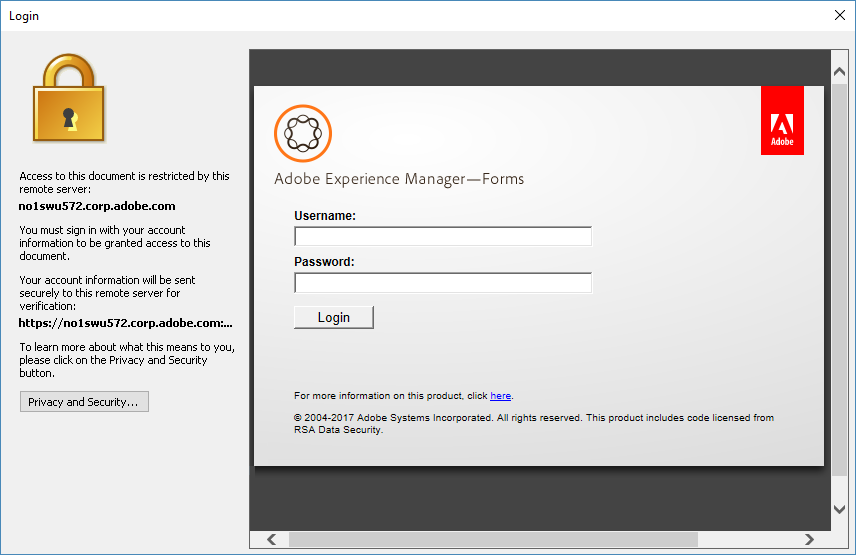

# Verwendung von AEM Document Security Extension für Microsoft® Office {#using-aem-document-security-extension-for-microsoft-office}

## Schützen von Dateien mithilfe von AEM Document Security Extension {#usingaemdocumentsecurityextensiontoprotectfiles}

Sie können steuern, wie Empfänger Ihre richtliniengeschützten Dateien verwenden, unabhängig davon, wie weit Sie sie verteilen.

Mit der Document Security Extension für Microsoft® Office können Sie folgende Aufgaben durchführen:

* Verbindung zu Document Security konfigurieren
* Richtlinie auf eine Datei anwenden
* Document Security-Web-Seiten öffnen, um Benutzerrichtlinien zu erstellen und zu verwalten
* Richtlinienschutz einer Datei aufheben
* Die für eine Datei geltende Richtlinie ändern
* Document Security-Web-Seiten öffnen, um den Dateizugriff zu sperren oder die Dateirichtlinie zu ändern
* Öffnen von Document Security-Webseiten, um den Prüfverlauf der Datei anzuzeigen

### Herstellen einer Verbindung zu einem Document Security-Server {#connect-to-a-document-security-server}

Wenn Sie Richtlinien auf Dateien anwenden möchten, müssen Sie die Verbindungseinstellungen für Document Security konfigurieren. Je nachdem, wie Document Security Extension für Microsoft® Office installiert wurde, haben Sie möglicherweise bereits Standardverbindungseinstellungen. Sie können Verbindungseinstellungen für eine oder mehrere Instanzen von Document Security hinzufügen. Sie können Server-Informationen vom Document Security-Administrator erhalten.

Sie müssen den Server, den Sie zum Schutz von Dateien oder zum Verwalten der geschützten Dateien verwenden möchten, als Standard-Server festlegen. Wenn Sie eine Richtlinie auf eine neue Datei anwenden oder die Document Security-Webseiten öffnen, stellt Document Security Extension für Microsoft® Office eine Verbindung zum Standard-Server her. Wenn Sie Dateien mit mehr als einer Instanz von Document Security schützen, müssen Sie die Standard-Server-Einstellung ändern, wenn Sie zwischen den Servern wechseln. Sie können Dateien öffnen, die durch eine beliebige Instanz von Document Security geschützt sind, solange Sie berechtigt sind, die Datei zu öffnen.

Wenn Ihr Document Security-Server die zertifikatsbasierte Authentifizierung verwendet, müssen Sie das Zertifikat, das Sie erhalten haben, auf Ihrem lokalen Rechner installieren. Sie müssen die Zertifikatsauthentifizierung auswählen und das Zertifikat angeben, das Sie zur Authentifizierung verwenden möchten.

Nachdem Sie die Verbindungseinstellungen für eine Instanz von Document Security in einem Microsoft® Office-Programm konfiguriert haben, ist diese für alle Word-, Excel- und PowerPoint-Programme konfiguriert.

#### Installieren des Client-seitigen Zertifikats {#install-the-client-side-certificate}

Wenn Sie auf die Document Security-Webseiten über Zertifikatauthentifizierung oder Zwei-Wege-Authentifizierung zugreifen müssen, erhalten Sie das Zertifikat, das Sie auf Ihrem lokalen Computer installieren müssen. Sie erhalten eine Zertifikatsdatei (.PFX- oder .P12-Datei) und das dazugehörige Kennwort.

1. Speichern Sie die Zertifikatdatei auf Ihrem lokalen Computer.
1. Doppelklicken Sie auf die Zertifikatsdatei, um den Zertifikatsimport-Assistenten zu öffnen, und klicken Sie auf **Weiter**.
1. Klicken Sie auf **Weiter**, wenn die Zertifikatsdatei im Feld „Dateiname“ aufgeführt ist. Klicken Sie auf **Durchsuchen**, wenn Sie ein anderes Zertifikat suchen möchten.
1. Geben Sie das Kennwort ein, das Sie erhalten haben, und klicken Sie auf **Weiter**.
1. Wählen Sie im Dialogfeld „Zertifikatspeicher“ die Option „Alle Zertifikate im folgenden Store platzieren“ und klicken Sie auf **Durchsuchen**.
1. Wählen Sie im Dialogfeld „Zertifikatspeicher auswählen“ die Option „Persönlich“, klicken Sie auf **OK**, klicken Sie auf **Weiter** und dann auf **Fertig stellen**.

#### Konfigurieren der Verbindungseinstellungen {#configure-connection-settings}

1. Wählen Sie in der Document Security Extension for Microsoft® Office 2010 und Office 2013 auf der Registerkarte **Document Security** die Option **Server auswählen** aus.
1. Klicken Sie entweder auf **Neu**, um Verbindungseinstellungen zu erstellen, oder wählen Sie eine bestehende Verbindung aus und klicken Sie auf **Bearbeiten**.
1. Geben Sie im Feld **Name** einen Namen für die Verbindung ein. Sie können einen beliebigen Namen verwenden.
1. Geben Sie die Adresse des Servers in das Feld **Server-Adresse** ein.
1. Geben Sie den Serverport in das Feld **Port** ein.
1. (Optional) Wenn Sie Ihren Benutzernamen und Ihr Kennwort speichern möchten, wählen Sie **Kennwort auf diesem Computer speichern** aus und geben Sie Ihren Benutzernamen und Ihr Kennwort in die entsprechenden Felder ein. Es wird empfohlen, diese Option nicht auszuwählen, wenn andere Personen Zugriff auf den Computer haben könnten.
1. Klicken Sie auf **Mit diesem Server verbinden**. Document Security Extension für Microsoft® Office versucht, eine Verbindung mit dem angegebenen Server herzustellen. Führen Sie je nach angegebenem Authentifizierungstyp einen der folgenden Schritte aus:

   **Benutzername und Kennwort**

   Geben Sie den Benutzernamen und das Kennwort ein, die Sie vom Document Security-Administrator erhalten haben.

   **Zertifikatauthentifizierung**

   Wählen Sie diese Option aus, um das Zertifikat auszuwählen, das Sie erhalten und in Ihrem persönlichen Zertifikatspeicher installiert haben.

   Wenn nur ein Authentifizierungstyp für Document Security konfiguriert ist, wird nur diese Option angezeigt.

>[!NOTE]
>
>Wenn Sie keine Verbindung mit dem Server herstellen können, versuchen Sie, die Document Security-Web-Seiten in Internet Explorer zu öffnen. Wenn Sie mit Internet Explorer keine Verbindung zum Server herstellen können oder wenn in einem Dialogfeld eine Warnung bezüglich des Server-Zertifikats angezeigt wird, kann Document Security Extension für Microsoft® Office keine Verbindung zum Server herstellen. Wenden Sie sich an die Server-Admins, um Hilfe zu erhalten.

>[!NOTE]
Wenn Sie keine Verbindung zu Document Security herstellen können, wird eine Meldung angezeigt, die besagt: „Der Benutzername und das Kennwort sind falsch. Bitte überprüfen Sie Ihre Konfigurationseinstellungen und versuchen Sie es erneut“. Diese Meldung kann angezeigt werden, wenn Sie aus einem anderen Grund keine Verbindung herstellen können. Wenn Sie zum ersten Mal eine Verbindung mit dem Server herstellen, überprüfen Sie, ob Sie den Namen und Port des Servers richtig eingestellt haben.

#### Festlegen des Standard-Servers {#specify-the-default-server}

1. Gehen Sie folgendermaßen vor:

   * Wählen Sie in Document Security Extension für Microsoft® Office 2010 und Office 2013 auf der Registerkarte **Document Security** die Option **Server auswählen** aus.

1. Wählen Sie einen Server aus, der als Standard festgelegt werden soll, und klicken Sie auf **Standard festlegen**. Neben dem Standard-Server wird ein Stern angezeigt.

### Verwenden von Authentifizierungsanbietern von Drittanbietern {#using-third-party-authentication-providers}

Sie können externe Authentifizierungsanbieter in AEM Forms Document Security verwenden. Mit diesen Authentifizierungsanbietern können Sie eine zusätzliche Zugriffsebene zu den geschützten Dokumenten hinzufügen. AEM Forms Document Security unterstützt die folgenden erweiterten Authentifizierungs-Workflows:

* Erweiterte Authentifizierung mit AEM Forms-Standard-URL
* Erweiterte Authentifizierung mit einer benutzerdefinierten URL
* Erweiterter Standardauthentifizierungs-Workflow mit Identitäts-Drittanbietern, die auf AEM Forms auf JEE-Server konfiguriert sind
* Erweiterter benutzerdefinierter Authentifizierungs-Workflow mit Identitäts-Drittanbietern, die auf AEM Forms auf JEE-Server konfiguriert sind
* Erweiterte Authentifizierung mit benutzerdefinierter Seite für die Auflistung von SAML-Authentifizierungen

#### Erweiterte Authentifizierung mit AEM Forms-Standard-URL {#extended-authentication-using-default-aem-forms-url}

Sie können die standardmäßige AEM Forms-URL für die erweiterte Authentifizierung verwenden. Die Standard-Landingpage enthält das Branding von Adoben. Darüber hinaus werden bei der Verwendung der standardmäßigen AEM Forms-URL für die erweiterte Authentifizierung die standardmäßigen AEM Forms-Einstellungen verwendet.

Führen Sie die folgenden Schritte aus, um die erweiterte Authentifizierung mit der standardmäßigen Adobe-Landing-URL zu aktivieren:

1. Öffnen Sie die AEM Forms Admin-Benutzeroberfläche.
1. Navigieren Sie zu Dienste > Document Security > Konfiguration > Serverkonfiguration.
1. Aktivieren Sie die Option Erweiterte Authentifizierung zulassen .
1. Geben Sie die Standard-URL für die erweiterte Authentifizierungs-Landingpage an. Die Standard-URL lautet http://localhost:8080/edc/extendedauthentication/welcome.jsp.

   Klicken Sie auf **[!UICONTROL Speichern]**.

   >[!NOTE]
   Verwenden Sie einen vollständig qualifizierten Hostnamen in der URL. Es wird empfohlen, das HTTPS-Protokoll zu verwenden.

   Jetzt ist die AEM Forms-Dokumentensicherheit so konfiguriert, dass die erweiterte Authentifizierung mit der standardmäßigen Startseiten-URL für AEM Forms verwendet wird.

   

#### Erweiterte Authentifizierung mit einer benutzerdefinierten Startseiten-URL {#extended-authentication-with-a-custom-landing-url}

Sie können eine benutzerdefinierte URL für die erweiterte Authentifizierung verwenden. Es bietet die Flexibilität, eine benutzerdefinierte Authentifizierungsseite mit benutzerdefiniertem Branding anzuzeigen. Beispiel: Branding für Ihr Unternehmen.

Sie können die benutzerdefinierte Authentifizierungsseite in eine WAR-Datei packen und die WAR-Datei auf einem AEM Forms-Server bereitstellen. Die WAR-Datei enthält eine vollständige Logik zum Akzeptieren von Benutzeranmeldeinformationen und zum Authentifizieren gegenüber dem AEM Forms-Server. AEM Forms Document Security erfordert für die benutzerdefinierte Authentifizierungsseite die folgenden Anforderungen:

* Auf der Authentifizierungsseite sollte Benutzername als j_username und Kennwort als j_password gesendet werden. Die Seite sollte auch die source_url und login_url als ausgeblendete Parameter senden.
* Bei erfolgreicher Authentifizierung sollte die Seite automatisch geschlossen werden.

So aktivieren Sie die erweiterte Authentifizierung mit einer benutzerdefinierten Startseiten-URL:

1. Stellen Sie die benutzerdefinierte Authentifizierungs-WAR-Datei auf dem AEM Forms-Server bereit.
1. Öffnen Sie die AEM Forms Admin-Benutzeroberfläche.
1. Navigieren Sie zu Dienste > Document Security > Konfiguration > Serverkonfiguration.
1. Aktivieren Sie die Option Erweiterte Authentifizierung zulassen und geben Sie die benutzerdefinierte Landing-URL für erweiterte Authentifizierung an.
1. Fügen Sie der Datei config.xml unter dem SSO-Knoten nach dem Eintrag *&lt;node name=&quot;AllowedUrls&quot;>* die folgenden Einträge hinzu:

   >[!NOTE]
   &lt;entry key=&quot;sso-l&quot; value=&quot;/ sample_/login.jsp&quot;/>!!discoiqbr!!&lt;entry key=&quot;sso-s&quot; value=&quot;/ sample_/welcome.jsp&quot;>!!discoiqbr!!&lt;entry key=&quot;sso-o&quot; value=&quot;/ sample_/logout.jsp&quot;/>!!discoiqbr!!

   Schrittweise Informationen zum Aktualisieren der Datei &quot;config.xml&quot;finden Sie unter [Manuelles Bearbeiten der Document Security-Konfigurationsdatei](https://helpx.adobe.com/de/aem-forms/6-3/admin-help/configuring-client-server-options.html#manually_editing_the_document_security_configuration_file).

   Jetzt ist AEM Forms Document Security für die Verwendung der erweiterten Authentifizierung mit einer benutzerdefinierten Landingpage-URL konfiguriert

#### Standardmäßiger erweiterter Authentifizierungs-Workflow mit externen Identitätsanbietern, die auf dem AEM Forms-Server konfiguriert sind {#default-extended-authentication-workflow-with-third-party-identity-providers-configured-on-aem-forms-server}

Bei der erweiterten Authentifizierung können verschiedene Authentifizierungstypen verwendet werden, die auf dem AEM Forms-Server verfügbar sind. Zum Beispiel SAML. [Was sind weitere Beispiele].

Hinweis: Wenn SAML-Anbieter auf einem AEM Forms-Server konfiguriert sind, wird vor der Anzeige der Ziel-URL eine Seite mit allen für SAML-Authentifizierungen konfigurierten Identitätsanbietern angezeigt.

Der folgende Bildschirm wird angezeigt, wenn ein geschütztes Dokument in Acrobat geöffnet wird.

#### Benutzerdefinierter erweiterter Authentifizierungs-Workflow, wenn SAML-Anbieter auf einem AEM Forms-Server konfiguriert sind {#custom-extended-authentication-workflow-when-saml-providers-are-configured-on-aem-forms-server}

Wenn SAML-Anbieter auf einem AEM Forms-Server konfiguriert sind, wird vor der Anzeige der Ziel-URL eine Seite mit allen für SAML-Authentifizierungen konfigurierten Identitätsanbietern angezeigt.

Folgende Voraussetzungen müssen erfüllt sein, um einen benutzerdefinierten erweiterten Authentifizierungs-Workflow zu konfigurieren, wenn SAML-Anbieter auf einem AEM Forms-Server konfiguriert sind:

* SAML-Authentisierungen werden auf dem AEM Forms-Server konfiguriert
* Benutzerdefinierte WAR-Datei, die eine benutzerdefinierte Authentifizierungsseite und eine vollständige Logik zum Akzeptieren von Anmeldeinformationen und zum Authentifizieren beim AEM Forms-Server enthält, wird auf dem AEM Forms-Server bereitgestellt.

#### Verwenden der benutzerspezifischen Seite für die Überwachung der SAML-Authentisierungen {#using-custom-page-for-listing-saml-authentications}

Sie können eine benutzerdefinierte Seite auch angeben, um alle Authentifizierungsanbieter einzuschließen, die auf dem AEM Forms-Server konfiguriert sind. So erstellen Sie eine solche Seite:

1. Packen Sie die benutzerdefinierte Authentifizierungsseite in eine WAR-Datei und stellen Sie die WAR-Datei auf einem AEM Forms-Server bereit. Die WAR-Datei enthält eine vollständige Logik zum Akzeptieren von Benutzeranmeldeinformationen und zum Authentifizieren gegenüber dem AEM Forms-Server.
1. Öffnen Sie die Benutzeroberfläche von AEM Forms Admin und navigieren Sie zu **[!UICONTROL Einstellungen]** > **[!UICONTROL Benutzerverwaltung]** > **[!UICONTROL Konfiguration]** > **[!UICONTROL SAML Service Provider-Einstellungen]**.
1. Fügen Sie Folgendes zum Feld &quot;Benutzerdefinierte Eigenschaften&quot;hinzu und klicken Sie auf **[!UICONTROL Speichern]**.

   *saml.sp.discovery.url=/demoJSP/saml_discovery.jsp*

   Jetzt ist die AEM Forms-Dokumentensicherheit so konfiguriert, dass eine benutzerdefinierte Seite mit allen konfigurierten Authentifizierungsanbietern angezeigt wird.

### Beziehen eines Benutzerkontos {#obtaining-a-user-account}

Wenn Sie noch kein Document Security-Konto haben, kann Document Security den Registrierungsprozess einleiten, wenn diese Ereignisse eintreten:

* Ein Document Security-Benutzer, der Ihnen ein richtliniengeschütztes Dokument senden möchte, fügt Sie einer Richtlinie hinzu.
* Der Document Security-Administrator erstellt ein Konto für Sie.

Nachdem Sie sich registriert und Ihr Konto aktiviert haben, können Sie richtliniengeschützte Dateien verwenden, zu deren Nutzung Sie über eine Richtlinie berechtigt wurden.

>[!NOTE]
Wenn Sie eine richtliniengeschützte Datei erhalten und kein Document Security-Konto haben oder eine Einladung zur Registrierung erhalten, wenden Sie sich an die Person, die Ihnen die Datei zur Unterstützung geschickt hat.

Wenn Sie eine Einladungs-E-Mail zur Registrierung von Document Security erhalten, können Sie sich registrieren, indem Sie die URL in der E-Mail verwenden, um die Online-Registrierungsseite zu öffnen. Nach der Registrierung erhalten Sie einen zweiten Hinweis zur Aktivierung Ihres Kontos.

#### Beziehen eines externen Benutzerkontos {#obtain-an-external-user-account}

1. Öffnen Sie die Registrierungs-E-Mail von Document Security. Die in der Nachricht enthaltene URL ist ein Link zur Document Security-Registrierungsseite für externe Benutzer. Wenn Sie keine Registrierungsnachricht erhalten, wenden Sie sich an die Person, die Ihnen die Datei geschickt hat, um Hilfe zu erhalten.
1. Klicken Sie auf die URL oder kopieren Sie sie und fügen Sie sie in Ihren Browser ein.
1. Geben Sie Ihren Namen, Ihre Organisation und Ihr Kennwort in die entsprechenden Felder ein. Ihr Passwort kann eine beliebige Kombination aus acht Zeichen sein.

   >[!NOTE]
   Achten Sie darauf, dass Sie ein Passwort wählen, das leicht zu merken ist. Es gibt keine Methode, um vergessene Kennwörter zu finden.

1. Klicken Sie auf **Registrieren**. Es wird eine Meldung angezeigt, die Sie auffordert, Ihre E-Mail auf eine Aktivierungs-E-Mail zu überprüfen.
1. Öffnen Sie die Bestätigungs-E-Mail von Document Security.
1. Klicken Sie auf die in der Nachricht angegebene URL.
1. Klicken Sie auf den Link zur Anmeldeseite.
1. Geben Sie in das Feld **Benutzername** die E-Mail-Adresse ein, mit der Sie sich bei Document Security registriert haben. Diese E-Mail-Adresse ist Ihr Standardbenutzername für Document Security.
1. Geben Sie in das Feld **Kennwort** das Kennwort ein, das Sie bei der Registrierung erstellt haben.
1. Klicken Sie auf **Anmelden**.

### Richtlinien erstellen und verwalten {#creating-and-managing-policies}

Wenn Ihnen der Document Security-Administrator die Berechtigung erteilt hat, können Sie auf der Seite „Richtlinien“ der Document Security-Web-Seiten Richtlinien erstellen, die für Ihre eigenen Dateien gelten.

Einige der Richtlinieneinstellungen, die für das Erstellen von Richtlinien auf den Document Security-Web-Seiten verfügbar sind, werden für Word-, Excel- und PowerPoint-Dateien nicht unterstützt. In den folgenden Tabellen wird beschrieben, wie die Richtlinienberechtigungen den Word-, Excel- und PowerPoint-Funktionen zugeordnet sind.

<table>
 <thead>
  <tr>
   <th>
Berechtigungen
</th>
   <th>
Unterstützung für Word, Excel und PowerPoint
</th>
  </tr>
 </thead>
 <tbody>
  <tr>
   <td>
Drucken &gt; Nicht zulässig
</td>
   <td>
Das Drucken der Datei ist nicht zulässig.
</td>
  </tr>
  <tr>
   <td>
Drucken &gt; Zulässig
</td>
   <td>
Das Drucken der Datei ist zulässig.

<strong>Hinweis</strong>: <i>Wenn eine Richtlinie die Berechtigung „Kopieren“, aber nicht die Berechtigung „Drucken“ erteilt, kann in eine andere Datei kopierter Inhalt gedruckt werden.</i>
</td>
  </tr>
  <tr>
   <td>
Drucken &gt; Nur niedrige Auflösung
</td>
   <td>
Nicht zutreffend.
</td>
  </tr>
  <tr>
   <td>
Ändern &gt; Beliebig
</td>
   <td>
Die Datei kann geändert werden.

Wenn diese Berechtigung nicht erteilt wird, können Sie geschützte Word- und Excel-Dateien nicht ändern. Sie können PowerPoint-Dateien ändern, aber Sie können die Änderungen nicht speichern und Bildschirmpräsentationen für geänderte Dateien nicht anzeigen.
</td>
  </tr>
  <tr>
   <td>
Ändern &gt; Nicht zulässig
</td>
   <td>
Benutzer können keine geschützten Dateien ändern.
</td>
  </tr>
  <tr>
   <td>
Ändern &gt; Seiten ändern
</td>
   <td>
Nicht zutreffend.

Umfasst das Einfügen, Löschen und Drehen von Seiten.
</td>
  </tr>
  <tr>
   <td>
Ändern &gt; Ausfüllen und Unterschreiben
</td>
   <td>
Nicht zutreffend.
</td>
  </tr>
  <tr>
   <td>
Offline
</td>
   <td>
Die Datei kann offline geöffnet werden.
</td>
  </tr>
  <tr>
   <td>
Kopieren
</td>
   <td>
Dateiinhalte können in andere Dateien kopiert werden.
</td>
  </tr>
  <tr>
   <td>
Screen Reader 
</td>
   <td>
Bildschirmlesehilfen (Geräte für Benutzer mit Sehbehinderung) können den Dateiinhalt lesen.
</td>
  </tr>
  <tr>
   <td>
Gültigkeit der Berechtigung
</td>
   <td>
Unterstützt.
</td>
  </tr>
 </tbody>
</table>

<table>
 <thead>
  <tr>
   <th>
Allgemeine Einstellungen
</th>
   <th>
Unterstützung für Word, Excel und PowerPoint
</th>
  </tr>
 </thead>
 <tbody>
  <tr>
   <td>
Gültigkeitsdauer
</td>
   <td>
Unterstützt.
</td>
  </tr>
  <tr>
   <td>
Dokument prüfen
</td>
   <td>
Unterstützt.
</td>
  </tr>
  <tr>
   <td>
Automatische Offline-Nutzungsdauer
</td>
   <td>
Unterstützt.
</td>
  </tr>
  <tr>
   <td>
Externe Autorisierungsanbieter
</td>
   <td>
Unterstützt.
</td>
  </tr>
 </tbody>
</table>

<table>
 <thead>
  <tr>
   <th>
Erweiterte Einstellungen
</th>
   <th>
Unterstützung für Word, Excel und PowerPoint
</th>
  </tr>
 </thead>
 <tbody>
  <tr>
   <td>
Dynamische Wasserzeichen
</td>
   <td>
Unterstützt.
</td>
  </tr>
  <tr>
   <td>
Zertifizierungs-Plug-ins
</td>
   <td>
Nicht zutreffend.
</td>
  </tr>
  <tr>
   <td>
Verschlüsselungsalgorithmus und Schlüssellänge 
</td>
   <td>
Alle Optionen werden unterstützt.
</td>
  </tr>
  <tr>
   <td>
Dokumenteinschränkung
</td>
   <td>
Alle Dateiinhalte werden unabhängig von der Einstellung in der Richtlinie immer verschlüsselt.
</td>
  </tr>
  <tr>
   <td>
Fehlermeldung „Zugriff verweigert“
</td>
   <td>
Unterstützt.
</td>
  </tr>
 </tbody>
</table>

Weitere Informationen zum Erstellen und Verwalten von Richtlinien finden Sie in der [Document Security-Hilfe für Endbenutzer](https://help.adobe.com/de_DE/AEMForms/6.1/RMHelp/).

### Richtlinien anwenden {#applying-policies}

Sie können alle verfügbaren Richtlinien auf eine Datei anwenden, einschließlich der Richtlinien, die Sie erstellt haben, und der Richtlinien, die Teil der Richtliniensätze sind, auf die Sie Zugriff haben. Bevor Sie eine Richtlinie anwenden, müssen Sie die Datei speichern.

Nachdem Sie eine Richtlinie angewendet haben, wird sie der Liste &quot;Zuletzt verwendet&quot;im Menü AEM Document Security hinzugefügt, damit Sie die am häufigsten verwendeten Richtlinien leichter anwenden können. Wenn Sie mehr als eine Instanz von Document Security verwenden, zeigt die Liste &quot;Zuletzt verwendet&quot;nur die Richtlinien für den Server an, mit dem Sie derzeit verbunden sind, oder für Ihren Standardserver, wenn Sie sich noch nicht bei einer Instanz von Document Security angemeldet haben.

>[!NOTE]
Sie können Richtlinien nur auf Word-Dokumentdateien (.doc, auch .docx und .docm in Microsoft® Office 2010 und 2013), Excel-Arbeitsmappendateien (.xls, auch .xlsx und .xlsm in Microsoft® Office 2010 und 2013) und PowerPoint-Präsentationsdateien (.ppt, auch .pptx und .pptm in Microsoft® Office 2010 und 2013) anwenden. Richtlinien können nicht auf Word-Vorlagendateien (.dot), Excel-Vorlagendateien (.xlt) und PowerPoint-Design-Vorlagendateien (.pot) angewendet werden.

#### Anwenden einer Richtlinie {#apply-a-policy}

1. Wählen Sie in Document Security Extension für Microsoft® Office 2010 und 2013 auf der Registerkarte **Document Security** die Option **Sichern > Richtlinie auswählen** aus.

   Wenn Sie Benutzernamen und Kennwort als Authentifizierungsmethode auf dem Server ausgewählt und noch keine Anmeldeinformationen für Document Security angegeben haben, werden Sie in einem Dialogfeld zur Eingabe Ihres Benutzernamens und Kennworts aufgefordert.

1. Wählen Sie eine Richtlinie in der Liste aus und klicken Sie auf **Übernehmen**.
1. Speichern Sie die Datei.

#### Anwenden einer kürzlich verwendeten Richtlinie {#apply-a-recently-used-policy}

1. Wählen Sie in Document Security Extension für Microsoft® Office 2010 und 2013 auf der Registerkarte **Document Security** die Option **Sichern > ***[Richtlinienname]* aus.
1. Speichern Sie die Datei.

## Arbeiten mit richtliniengeschützten Dateien {#usingaemdocumentsecurityextensionpolicyprotectedfiles}

Richtliniengeschützte Dateien enthalten geistiges Eigentum, das Eigentum des Dateiherausgebers ist und durch Document Security geschützt wird.

Sie können richtliniengeschützte Dateien verwenden, unabhängig davon, ob Sie intern oder extern in der Organisation des Dateiherausgebers tätig sind. Um richtliniengeschützte Dateien zu öffnen, müssen Sie von Document Security erkannt werden, entweder durch Aufnahme in eine verknüpfte LDAP- oder Active Directory-Liste, die als lokaler Benutzer für LiveCycle oder AEM Forms on JEE hinzugefügt wird, oder durch Registrierung bei Document Security nach der Einladung als Benutzer.

Wenn Sie eine richtliniengeschützte Datei erhalten und kein Document Security-Konto haben oder eine Einladung zur Registrierung erhalten, wenden Sie sich an die Person, die Ihnen die Datei zur Unterstützung geschickt hat.

### Arbeiten mit richtliniengeschützten Dateien in Microsoft® Office {#working-with-policy-protected-files-in-microsoft-office}

Document Security Extension für Microsoft® Office schränkt bestimmte Word-, Excel- und PowerPoint-Funktionen ein, um das geistige Eigentum des Dateiherausgebers zu schützen. Wenn Sie keine Berechtigung zum Ändern der Datei haben, können Sie keine Änderungen an der Datei speichern.

Wenn Sie mit einer richtliniengeschützten Datei arbeiten, stehen einige Produktfunktionen möglicherweise nicht zur Verfügung oder funktionieren nicht wie gewohnt. Wenn Sie auch eine ungeschützte Datei geöffnet haben, sind die meisten Funktionen für die ungeschützte Datei aktiviert, mit Ausnahme derjenigen, die es Ihnen ermöglichen, Inhalte aus einer richtliniengeschützten Datei zu importieren oder zu kopieren, für die Sie keine Kopier- oder Exportberechtigung haben.

>[!NOTE]
Wenn Sie von Document Security Extension unterstützte Office-Programme verwenden, wird empfohlen, die Windows DEP-Einstellung zu deaktivieren. Wenn Sie außerdem einen reibungslosen Start von Office-Programmen auf Computern mit installierter Document Security Extension und aktiviertem McAfee VirusScan mit Überprüfung bei Zugriff sicherstellen möchten, deaktivieren Sie die Option „Pufferüberlaufschutz“ in der McAfee VirusScan-Konsole.

Wenn eine Funktion nicht verfügbar ist, sind der Befehlsname im Menü und die entsprechende Schaltfläche in der Symbolleiste nicht verfügbar. Wenn Sie in Document Security Extension für Microsoft® Office mit dem Mauszeiger über den Befehl oder die Schaltfläche fahren, zeigt ein Tooltip an, dass der Befehl durch Document Security nicht verfügbar ist.

### Öffnen richtliniengeschützter Dateien {#opening-policy-protected-files}

Sie können richtliniengeschützte Dateien wie jede andere Datei öffnen. Wenn Sie nicht bereits bei Document Security angemeldet sind, werden Sie aufgefordert, dies zu tun, es sei denn, Sie sind nicht mit dem Internet verbunden und können die Datei offline öffnen. Wenn Sie den Anmeldevorgang abbrechen, wird der Zugriff verweigert.

Wenn Sie nicht berechtigt sind, die Datei zu öffnen, werden Sie darüber informiert, dass der Zugriff verweigert wird. Wenn die Zugriffsrechte für die Datei entzogen wurden, werden Sie möglicherweise auch zu einer aktualisierten Version der Datei weitergeleitet, falls eine solche verfügbar ist. Wenn Sie eine richtliniengeschützte Datei nicht öffnen können, wenden Sie sich an den Herausgeber der Datei, um weitere Unterstützung zu erhalten.

Wenn eine geschützte Datei geöffnet ist, gibt der Text in der Titelleiste, der auf den Dateinamen folgt, an, dass die Datei durch AEM Document Security geschützt ist.

Wenn Sie ein geschütztes Dokument in Document Security Extension für Microsoft® Office von SharePoint Server aus öffnen, stellen Sie sicher, dass das mit dem Dateityp verknüpfte Microsoft® Office-Programm, z. B. Microsoft® Word, Microsoft ®Excel oder Microsoft® PowerPoint, geöffnet ist. Wenn Sie versuchen, die Datei zu öffnen, ohne das zugehörige Programm geöffnet zu haben, wird das Dokument möglicherweise nicht geöffnet. Es wird eine Fehlermeldung angezeigt, die besagt, dass Sie das entsprechende Plug-in installieren müssen. Zusätzlich zum Öffnen des erforderlichen Programms wird empfohlen, dass Sie den Cache-Ordner leeren, bevor Sie ein geschütztes Dokument in Document Security Extension für Microsoft® Office vom SharePoint Server aus öffnen. Wenn Sie ein geschütztes Dokument über SharePoint Server öffnen, werden alle Berechtigungen für das Dokument deaktiviert, unabhängig von der angewendeten Richtlinie.

Je nach der in Document Security implementierten Authentifizierungsmethode werden Sie beim Öffnen eines geschützten Dokuments möglicherweise aufgefordert, die Authentifizierungsmethode auszuwählen. Wenn Document Security mehr als eine Authentifizierungsmethode unterstützt, werden die Authentifizierungsoptionen angezeigt. Wenn der Document Security-Server z. B. sowohl Benutzername-/Kennwort- als auch Zertifikatsauthentifizierung bietet, können Sie die entsprechende Authentifizierungsmethode wählen. Wenn die zertifikatbasierte Authentifizierung aktiviert ist, werden Sie aufgefordert, das Zertifikat zu verwenden, das Sie erhalten und installiert haben.

Das Kundenerlebnis beim Öffnen geschützter Dateien hängt von der Konfiguration der gegenseitigen Authentifizierung auf dem Server ab. Wenn nur ein gültiges Client-Zertifikat installiert ist, wird kein Authentifizierungsdialogfeld angezeigt und die Dateien werden erfolgreich geöffnet. Sind jedoch mehrere Client-Zertifikate auf einem Computer installiert, wird ein Authentifizierungsdialogfeld angezeigt. Der Benutzer muss ein gültiges Zertifikat auswählen, um die geschützte Datei zu öffnen.

### Aufheben des Richtlinienschutzes einer Datei {#removing-policy-protection-from-a-file}

Falls Sie die Berechtigung haben, können Sie den Richtlinienschutz von Dateien aufheben, die Sie geschützt haben. In diesem Fall ist die Datei nicht mehr durch Document Security geschützt.

1. Wählen Sie in Document Security Extension für Microsoft® Office 2010 und 2013 auf der Registerkarte **Document Security** die Option **Entfernen**.

   Wenn Sie noch keine Anmeldeinformationen für Document Security angegeben haben, werden Sie in einem Dialogfeld aufgefordert, Ihren Benutzernamen und Ihr Kennwort einzugeben.

>[!NOTE]
Wenn Sie eine Richtlinie nicht von einer geschützten Datei entfernen können, wenden Sie sich an einen Document Security-Administrator.

### Anzeigen von Sicherheitseinstellungen {#viewing-security-settings}

Sie können die Berechtigungen, die Sie für die aktuelle Datei zum Drucken, Kopieren, Ändern und Zugreifen auf Offline haben, zusammen mit der Gültigkeitsdauer der Datei anzeigen.

In Document Security Extension für Microsoft® Office 2010 zeigt die Gruppe „Sicherheitsstatus“ auf der Registerkarte „Document Security“ Ihre Berechtigungen für die Datei an.

Gehen Sie folgendermaßen vor:

* Klicken Sie in Document Security Extension für Microsoft® Office 2010 und 2013 auf der Registerkarte **Document Security** in der Gruppe **Sicherheitsstatus** auf ein beliebiges Element.

### Speichern von Dokumenten, wenn die Richtlinie zum automatischen Anwenden aktiviert ist {#saving-documents-when-auto-apply-policy-is-enabled}

Wenn Ihr Admin die Funktion zum automatischen Anwenden von Richtlinien aktiviert hat, werden alle Dokumente, die Sie erstellen oder bearbeiten, beim Speichern des Dokuments automatisch geschützt.

Wenn die Richtlinie für die automatische Anwendung aktiviert ist, werden Sie von Document Security Extension für Microsoft® Office aufgefordert, sich beim Document Security-Server anzumelden. Sie müssen Ihren Benutzernamen und Ihr Passwort angeben, um vom Server authentifiziert zu werden. Wenn Sie die richtigen Anmeldeinformationen angegeben haben, wird das Dokument gespeichert und geschützt.

>[!NOTE]
Wenn Sie sich nicht bei Document Security anmelden können, wird das Dokument möglicherweise gespeichert. Dies hängt davon ab, wie Ihr Administrator die Richtlinie zur automatischen Anwendung konfiguriert hat. Wenden Sie sich an den Administrator, um zu erfahren, wie Dokumente in diesem Fall behandelt werden.

### Synchronisieren für den Offline-Zugriff {#synchronizing-for-offline-access}

Richtlinien können Ihnen erlauben, Dateien zu öffnen, während Sie offline sind und nicht mit Document Security verbunden sind. Sie müssen sich zuvor bei Document Security angemeldet haben, um Ihre Anmeldeinformationen beim Server einzurichten, bevor Sie offline arbeiten können. Wenn Sie planen, mit Dateien offline zu arbeiten, wird empfohlen, dass Sie sich mit Document Security synchronisieren, bevor Sie die Verbindung trennen, um sicherzustellen, dass die Richtlinieneinstellungen für Ihre Dateien auf dem Server aktuell sind. Es wird empfohlen, dass Sie die Datei auch einmal online öffnen, bevor Sie sie offline öffnen. Wenn Sie die Datei nicht einmal online öffnen oder mit dem Server synchronisieren, können Sie möglicherweise weiterhin richtliniengeschützte Dateien verwenden, wenn Sie offline sind. Die Offline-Nutzungsdauer darf jedoch nicht abgelaufen sein, und die Richtlinieneinstellungen für die Datei dürfen sich seit der letzten manuellen oder automatischen Synchronisierung mit dem Server nicht geändert haben.

Gehen Sie folgendermaßen vor:

* Wählen Sie in Document Security Extension für Microsoft® Office 2010 und 2013 auf der Registerkarte **Document Security** die Option **Offline synchronisieren**.

   ***Hinweis**: Die Schaltfläche „Offline synchronisieren“ ist verfügbar, obwohl der Benutzer keine Offline-Berechtigung für dieses Dokument hat. Das Klicken auf die Schaltfläche bleibt jedoch wirkungslos. *

### Arbeiten mit Wasserzeichen {#working-with-dynamic-watermarks}

Document Security Extension für Microsoft® Office unterstützt das Einfügen dynamischer textbasierter Wasserzeichen in richtliniengeschützten Dokumenten. Ein dynamisches Wasserzeichen kann Informationen enthalten, die sich ändern können, wie z. B. das Datum, die Uhrzeit, den Benutzernamen oder den Namen der Richtlinie. Wenn ein Benutzer eine richtliniengeschützte Datei druckt und diese Datei ein dynamisches Wasserzeichen und die Druckberechtigung enthält, wird das Wasserzeichen in der Ausgabe angezeigt.

Document Security Extension unterstützt keine umfangreichen Wasserzeichen-Funktionen wie PDF-basierte Wasserzeichen, mehrere Elemente in einem Wasserzeichen, Textformatierungsoptionen und Seitenbereiche.

Ein dynamisches Wasserzeichen wird mithilfe der Document Security-Web-Seiten erstellt. Weitere Informationen zum Erstellen dynamischer Wasserzeichen in richtliniengeschützten Dokumenten finden Sie in der [Document Security-Hilfe für Endbenutzer](https://www.adobe.com/go/learn_lc_euRightsMgmt_11_de).

Document Security Extension für Microsoft® Office unterstützt die folgenden Wasserzeichenfunktionen:

<table>
 <thead>
  <tr>
   <th>
Document Security-Wasserzeichenoptionen
</th>
   <th>
Unterstützung für Word, Excel und PowerPoint
</th>
  </tr>
 </thead>
 <tbody>
  <tr>
   <td>
Richtlinienname
</td>
   <td>
Unterstützt.
</td>
  </tr>
  <tr>
   <td>
Name des Wasserzeichens
</td>
   <td>
Unterstützt.
</td>
  </tr>
  <tr>
   <td>
Als Hintergrund verwenden
</td>
   <td>
Das Anzeigeverhalten eines dynamischen Wasserzeichens ist dasselbe, unabhängig davon, ob Sie „Als Hintergrund verwenden“ auswählen.

Bei Word 2010 und 2013 wird das dynamische Wasserzeichen nur in der Druckansicht und in der Druckvorschau angezeigt. 

Auch für Excel 2010 und 2013 wird es in der Druckvorschau und in den Seitenlayoutansichten angezeigt.
</td>
  </tr>
  <tr>
   <td>
Vertikale Position
</td>
   <td>
Unterstützt
</td>
  </tr>
  <tr>
   <td>
Horizontale Position
</td>
   <td>
Unterstützt

Für Excel 2010 und 2013 funktioniert die horizontale Positionierung von Wasserzeichen unter Verwendung von Punkten nicht.
</td>
  </tr>
  <tr>
   <td>
Skalierung
</td>
   <td>
Unterstützt
</td>
  </tr>
  <tr>
   <td>
Position
</td>
   <td>
Unterstützt
</td>
  </tr>
  <tr>
   <td>
Transparenz
</td>
   <td>
Unterstützt
</td>
  </tr>
 </tbody>
</table>

### Öffnen der Document Security-Web-Seiten {#opening-the-document-security-web-pages}

Sie können die Document Security-Web-Seiten öffnen, um Ihre Benutzerrichtlinien zu erstellen und zu aktualisieren und um Status- und Audit-Informationen über Ihre richtliniengeschützten Dateien anzuzeigen. Sie können die Document Security-Web-Seiten auch verwenden, um Richtlinien zu ändern oder den Zugriff für eine richtliniengeschützte Datei zu sperren.

Zum Öffnen von Document Security-Webseiten in Document Security Extension for Microsoft® Office 2010 und 2013 wählen Sie auf der Registerkarte **Document Security** die Option **Richtlinien erstellen und verwalten** aus. Wenn Sie keine Anmeldeinformationen angegeben haben, zeigt der Browser die Seite zur Server-Anmeldung an.

### Ändern von Richtlinien {#changing-policies}

Wenn Sie über Berechtigungen verfügen, in der Regel als Document Security-Administrator oder als Herausgeber der Datei, können Sie später eine andere Richtlinie auf eine Datei anwenden oder die Einstellungen der aktuell angewendeten Richtlinie ändern.

Um die Einstellungen für eine Richtlinie zu ändern, verwenden Sie die Document Security-Web-Seiten.

1. Gehen Sie folgendermaßen vor:

   * Wählen Sie in Document Security Extension für Microsoft® Office 2010 und 2013 auf der Registerkarte **Document Security** die Option **Sichern > Richtlinie ändern** aus.

1. Wählen Sie eine Richtlinie in der Liste aus und klicken Sie auf **Übernehmen**.

### Sperren von Dateizugriffsberechtigungen {#revoking-file-access-privileges}

Sie können die Möglichkeit zum Öffnen von Dateien, die Sie geschützt haben, widerrufen. Wenn Sie die Zugriffsrechte für eine Datei widerrufen, können Sie auch die Meldung angeben, die jedem angezeigt wird, der versucht, die Datei zu öffnen, sowie die URL zu einer aktualisierten Version der Datei, wenn Sie sie durch eine überarbeitete Kopie ersetzen.

1. Gehen Sie folgendermaßen vor:

   * Wählen Sie in Document Security Extension für Microsoft® Office 2010 und 2013 auf der Registerkarte **Document Security** die Option **Sperren** aus.

   Die Document Security-Web-Seiten werden auf der Seite „Dokumente widerrufen“ geöffnet.

1. Geben Sie eine anzuzeigende Meldung und, falls verfügbar, eine URL für die aktualisierte Version an und klicken Sie auf **OK**.

Weitere Informationen zum Sperren von Dateizugriffsberechtigungen finden Sie unter [Hilfe für Endbenutzer von Document Security](https://help.adobe.com/de_DE/AEMForms/6.1/RMHelp/).

Auf den Document Security-Web-Seiten können Zugriffsberechtigungen reaktiviert werden.

### Anzeigen des Prüfverlaufs einer Datei {#viewing-the-file-audit-history}

Document Security kann den Prüfverlauf für richtliniengeschützte Dateien speichern, damit Sie die Aktionen, die Benutzer mit Ihren Dateien durchführen, prüfen können.

Zu den geprüften Ereignissen für Word-, Excel- und PowerPoint-Dateien gehören:

**Neues Dokument sichern** Richtlinie auf eine Datei angewendet

**Dokument anzeigen** Datei geöffnet

**Dokument schließen** Datei geschlossen

**Dokument widerrufen** Zugriffsrechte für Datei entfernt

**Widerrufen des Dokuments aufheben** Zugriffsrechte für die Datei zurückgegeben

**Dokument ändern** Datei geändert und lokal gespeichert

**Drucken mit hoher Auflösung** Datei gedruckt

**Sicherheits-Handler ändern** Richtlinienschutz von der Datei entfernt

**Richtlinie für Dokument wechseln** Neue Richtlinie auf Datei von den Document Security-Web-Seiten angewendet

### Prüfverlauf einer Datei anzeigen {#view-the-audit-history-for-a-file}

Wählen Sie in Document Security Extension für Microsoft® Office 2010 und 2013 auf der Registerkarte **Document Security** die Option **Prüfverlauf** aus.

Die Document Security-Web-Seiten werden auf der Seite „Ereignisse“ geöffnet, auf der die geprüften Ereignisse für die aktuelle Datei angezeigt werden.

### Einschränkung von Microsoft® Office-Funktionen {#microsoft-office-restricted-features}

Zum Schutz Ihres geistigen Eigentums stehen einige Microsoft® Office-Funktionen nicht zur Verfügung, wenn eine richtliniengeschützte Datei geöffnet ist. Die Liste der nicht verfügbaren Funktionen hängt von den Berechtigungen ab, die dem aktuellen Benutzer gewährt werden. Einige Features sind nur für eine geschützte Datei nicht verfügbar, während andere für alle Dateien nicht verfügbar sind, wenn Sie sich in einer geschützten Sitzung befinden. Im Allgemeinen befinden Sie sich ab dem Öffnen einer richtliniengeschützten Datei in einer geschützten Sitzung, bis Sie das Programm schließen oder die Sitzung abläuft.

Die meisten Richtlinien gewähren dem Herausgeber der Datei volle Berechtigungen. Für andere Benutzer gelten möglicherweise zusätzliche Funktionseinschränkungen.

Wenn ein Befehl nicht verfügbar ist, werden der Befehlsname im Menü und die entsprechende Schaltfläche in der Symbolleiste grau dargestellt.

>[!NOTE]
Beim Anwenden einer Richtlinie auf eine Datei, die einen Link zu einer eingebetteten Datei enthält, wird die Richtlinie nicht auf die verknüpfte Datei angewendet. Document Security for Microsoft® Office erweitert den Schutz nicht auf verknüpfte Dateien.

* Richtliniengeschützte Word-, Excel- und PowerPoint-Dateien können nicht in einem Internet Explorer-Browserfenster geöffnet werden.
* Benutzer, denen nur die Berechtigung „Ändern“ erteilt wurde, können über die Windows-Zwischenablage keine Inhalte aus einem anderen Programm in eine Datei kopieren. Benutzende können Inhalte in Dateien kopieren, indem sie die Option „Microsoft® Office-Zwischenablage“ aktivieren.
* Wenn Sie eine richtliniengeschützte Datei in Microsoft® Office öffnen, ist die Taste „Bildschirm drucken“ nicht verfügbar, bis Sie das Programm schließen oder die Sitzung abläuft.
* Document Security für Microsoft® Office unterstützt nicht das Web-basierte verteilte Authoring und Versionierung (WebDAV). In den meisten Fällen ist es nicht möglich, eine richtliniengeschützte Datei aus einem WebDAV-Ordner zu öffnen. Wenn Sie eine richtliniengeschützte Datei öffnen können, haben Sie keine Berechtigungen zum Speichern, Drucken, Ändern oder Kopieren der Datei.

Zu den allgemeinen Sicherheitseinstellungen, die für richtliniengeschützte Dateien gelten, zählen die folgenden Einschränkungen:

Viele gängige Funktionen können in Word, Excel und PowerPoint während einer geschützten Sitzung eingeschränkt sein.

Wenn eine richtliniengeschützte Datei geöffnet ist, die den Benutzenden keine Änderungen erlaubt, sind alle Befehle, die die Datei in irgendeiner Weise ändern, nicht verfügbar. Es stehen nur die Befehle zum Öffnen oder Erstellen neuer Dokumente und zum Ändern der Programmvoreinstellungen zur Verfügung.

#### Einschränkungen für Word 2010 und Word 2013 {#word-2010-and-word-2013-restrictions}

Wenn Sie eine richtliniengeschützte Datei in Word öffnen, ist das Speichern der Informationen zur automatischen Dateiwiederherstellung nicht mehr verfügbar, bis Sie Word schließen und neu starten. Darüber hinaus sind die folgenden Funktionen in den beschriebenen Situationen eingeschränkt:

**Datei > Neu > Neu aus Vorhandenem** Verfügbar, aber Dateien, die mit diesem Befehl erstellt werden, während eine richtliniengeschützte Datei geöffnet ist, können nicht gespeichert werden. Der Inhalt der neuen Datei kann nicht in eine andere Datei kopiert werden.

**Datei > Speichern** Eingeschränkt durch die Berechtigung „Ändern“.

**Datei > Speichern unter** Alle Optionen eingeschränkt durch die Berechtigung „Ändern“.

**Datei > Drucken** Alle Optionen eingeschränkt durch die Berechtigung „Drucken“. Nicht verfügbar, es sei denn, die Richtlinie lässt Drucken mit hoher Auflösung zu.

**Datei > Speichern und senden** Alle Optionen während einer geschützten Sitzung nicht verfügbar.

**Datei > Info > Dokument schützen > Verschlüsseln mit
Kennwort, Digitale Signatur hinzufügen, Als endgültig markieren, Berechtigung einschränken
nach Personen** Während einer geschützten Sitzung nicht verfügbar.

**Datei > Workflows** Während einer geschützten Sitzung nicht verfügbar.

***Hinweis **: Die Möglichkeit zum Starten von Workflows aus den zu Microsoft® Office 2010 gehörenden Versionen von Word, Excel und PowerPoint ist nur in Office Professional Plus 2010, Office Enterprise 2010 und Office Ultimate 2010 sowie in den eigenständigen Versionen der einzelnen Programme verfügbar.*

**Blogpost > Veröffentlichen** Während einer geschützten Sitzung nicht verfügbar.

**Datei > Server > Menü für Datei-Server-Aufgaben** Während einer geschützten Sitzung nicht verfügbar.

**Startseite > Zwischenablage > Kopieren** Eingeschränkt durch die Kopierberechtigung. Wenn das Kopieren nicht zulässig ist, können kopierte Inhalte nicht in eine andere Datei oder in die Office-Zwischenablage eingefügt werden. Inhalte können innerhalb der geschützten Datei kopiert werden, wenn der Benutzer über die Berechtigung zum Ändern verfügt.

**Startseite > Zwischenablage > Einfügen** Eingeschränkt durch die Berechtigung „Ändern“.

**Startseite > Zwischenablage > Inhalte einfügen** Eingeschränkt durch die Berechtigung „Ändern“.

**Einfügen > Text > Objekt** Während einer geschützten Sitzung nicht verfügbar. Richtliniengeschützte Dateien können zu keinem Zeitpunkt eingefügt werden.

**Sendungen** Die meisten Optionen dieser Registerkarte sind während einer geschützten Sitzung nicht verfügbar.

**Überprüfen > Korrekturlesen > Recherche** Eingeschränkt durch die Kopierberechtigung. Nicht verfügbar, wenn das Kopieren nicht zulässig ist.

**Überprüfen > Korrekturlesen > Thesaurus** Eingeschränkt durch die Kopierberechtigung. Nicht verfügbar, wenn das Kopieren nicht zulässig ist.

**Überprüfen > Sprache > Übersetzen > Dokument
übersetzen** Mit Kopierberechtigung aktiviert.

**Überprüfen > Sprache > Übersetzen > Ausgewählten Text
übersetzen** Mit Kopierberechtigung aktiviert.

**Überprüfen > Sprache > Übersetzen > Übersetzungshilfe** Mit Kopierberechtigung aktiviert.

**Überprüfen > Vergleichen > Vergleichen** Während einer geschützten Sitzung nicht verfügbar. Richtliniengeschützte Dateien können zu keinem Zeitpunkt verglichen werden.

**Überprüfen > Schützen > Autoren blockieren** Während einer geschützten Sitzung nicht verfügbar.

**Überprüfen > Schützen > Bearbeitung einschränken** Während einer geschützten Sitzung nicht verfügbar.

**Ansicht > Makros** Einige Makros sind durch die Berechtigung „Kopieren“ eingeschränkt und nicht verfügbar, es sei denn, das Kopieren ist zugelassen.

**Add-Ins** Können während einer geschützten Sitzung weder hinzugefügt noch entfernt werden.

**Onlinezusammenarbeit** Während einer geschützten Sitzung nicht verfügbar.

**Haupt- und Unterdokumente** Unterdokumente unterliegen den Richtlinien für Hauptdokumente, wenn sie innerhalb des Hauptdokuments geöffnet werden. Wenn sie separat geöffnet werden, können Unterdokumente nicht gedruckt, kopiert oder geändert werden.

**Erneut zusammenfassen** Während einer geschützten Sitzung nicht verfügbar.

**Rahmen (und alle zugehörigen Befehle)** Während einer geschützten Sitzung nicht verfügbar.

**Dokumentbereich** Während einer geschützten Sitzung nicht verfügbar.

**Entwickler > Dokumentvorlage** Während einer geschützten Sitzung nicht verfügbar. Um auf diesen Befehl zuzugreifen, wählen Sie „Datei“ > „Optionen“ > „Anpassen“ > „Entwickler-Registerkarte“ > „Vorlagen“ > „Dokumentvorlage“ aus.

**Gliederung > Hauptdokument > Unterdokument erstellen,
Unterdokument einfügen** Während einer geschützten Sitzung nicht verfügbar.

#### Einschränkungen für Excel 2010 und Excel 2013 {#excel-2010-and-excel-2013-restrictions}

Die folgenden Funktionen sind in den beschriebenen Situationen eingeschränkt:

**Datei > Neu > Neu aus Vorhandenem** Verfügbar, aber Dateien, die mit diesem Befehl während einer geschützten Sitzung erstellt wurden, können nicht gespeichert werden. Der Inhalt der neuen Datei kann nicht in eine andere Datei kopiert werden.

**Datei > Speichern, Speichern unter** Eingeschränkt durch die Berechtigung „Ändern“.

**Datei > Speichern unter > PDF** Während einer geschützten Sitzung nicht verfügbar.

**Datei > Drucken** Eingeschränkt durch die Berechtigung „Drucken“. Nicht verfügbar, es sei denn, die Richtlinie lässt Drucken mit hoher Auflösung zu.

**Datei > Info > Dokument schützen** Während einer geschützten Sitzung nicht verfügbar.

**Datei > Info > Arbeitsmappe schützen** Während einer geschützten Sitzung nicht verfügbar.

**Datei > Speichern und senden** Während einer geschützten Sitzung nicht verfügbar.

**Datei > Optionen > Add-Ins** Können während einer geschützten Sitzung weder hinzugefügt noch entfernt werden.

**Datei > Workflows** Während einer geschützten Sitzung nicht verfügbar.

***Hinweis **: Die Möglichkeit zum Starten von Workflows aus den zu Microsoft® Office 2010 gehörenden Versionen von Word, Excel und PowerPoint ist nur in Office Professional Plus 2010, Office Enterprise 2010 und Office Ultimate 2010 sowie in den eigenständigen Versionen der einzelnen Programme verfügbar.*

**Datei > Server > Menü für Datei-Server-Aufgaben** Während einer geschützten Sitzung nicht verfügbar.

**Startseite > Zwischenablage > Kopieren** Eingeschränkt durch die Kopierberechtigung. Wenn das Kopieren nicht zulässig ist, können kopierte Inhalte weder in eine andere Datei noch in die Microsoft® Office-Zwischenablage eingefügt werden. Inhalte können innerhalb der geschützten Datei kopiert werden, wenn der Benutzer über die Berechtigung zum Ändern verfügt.

**Startseite > Zwischenablage > Einfügen** Eingeschränkt durch die Berechtigung „Ändern“.

**Startseite > Zwischenablage > Inhalte einfügen** Eingeschränkt durch die Berechtigung „Ändern“.

**Startseite > Zellen > Format > Blatt verschieben/kopieren** Während einer geschützten Sitzung nicht verfügbar.

**Startseite > Zellen > Einfügen > Blatt einfügen** Während einer geschützten Sitzung nicht verfügbar.

**Startseite > Zellen > Löschen > Blatt löschen** Während einer geschützten Sitzung nicht verfügbar.

**Startseite > Bearbeiten > Ausfüllen > Über Arbeitsblatt** Eingeschränkt durch die Berechtigung „Ändern“.

**Einfügen > Tabellen > Tabelle** Eingeschränkt durch die Berechtigung „Ändern“.

**Einfügen > Tabellen > PivotTable** Richtliniengeschützte Dateien können im Erstellungsassistenten nicht ausgewählt werden.

**Einfügen > Text > Objekt** Während einer geschützten Sitzung nicht verfügbar. Richtliniengeschützte Dateien können zu keinem Zeitpunkt eingefügt werden.

**Einfügen > Text > Kopf- und Fußzeile** Eingeschränkt durch die Berechtigung „Ändern“. Für ein richtliniengeschütztes Dokument nicht verfügbar.

**Daten > Externe Daten abrufen** Daten aus richtliniengeschützten Dateien können nicht importiert werden.

**Daten > Gliederung > Teilergebnisse** Eingeschränkt durch die Berechtigung „Ändern“.

**Daten > Datentools > Datenüberprüfung** Eingeschränkt durch die Berechtigung „Ändern“.

**Überprüfen > Korrekturlesen > Recherche** Eingeschränkt durch die Kopierberechtigung.

**Überprüfen > Korrekturlesen > Thesaurus** Eingeschränkt durch die Kopierberechtigung.

**Überprüfen > Sprache > Übersetzen** Eingeschränkt durch die Kopierberechtigung.

**Überprüfen > Änderungen > Blatt schützen** Während einer geschützten Sitzung nicht verfügbar.

**Überprüfen > Änderungen > Arbeitsmappe schützen** Während einer geschützten Sitzung nicht verfügbar.

**Überprüfen > Änderungen > Arbeitsmappe freigeben** Während einer geschützten Sitzung nicht verfügbar.

**Überprüfen > Änderungen > Arbeitsmappe schützen und freigeben** Während einer geschützten Sitzung nicht verfügbar.

**Überprüfen > Änderungen > Benutzerberechtigungen zum Bearbeiten von Bereichen** Während einer geschützten Sitzung nicht verfügbar.

**Überprüfen > Änderungen > Änderungen nachverfolgen > Änderungen
hervorheben** Nicht verfügbar für eine richtliniengeschützte Datei, die ein dynamisches Wasserzeichen enthält.

**Ansicht > Makros** Eingeschränkt durch die Berechtigung „Ändern“.

**Ansicht > Arbeitsbereich speichern** Der Befehl funktioniert nicht.

**Entwickler > XML > Erweiterungspakete** Einige Makros sind durch die Berechtigung „Kopieren“ eingeschränkt und nicht verfügbar, es sei denn, das Kopieren ist zugelassen.

**Formeln > Formelüberwachung > Fehlerüberprüfung** Eingeschränkt durch die Berechtigung „Ändern“. Nicht verfügbar, es sei denn, Änderungen sind zulässig.

**Onlinezusammenarbeit** Während einer geschützten Sitzung nicht verfügbar.

**Infos zum automatischen Wiederherstellen speichern** Während einer geschützten Sitzung nicht verfügbar.

***Hinweis **: Wenn Sie versuchen, eine Zelle in einer richtliniengeschützten Datei zu ändern, für die Sie keine Änderungsberechtigungen haben, zeigt Excel die unzutreffende Fehlermeldung an, dass Sie über den Befehl „Blattschutz aufheben“ den Schutz der Datei aufheben müssen. Über den Befehl „Blattschutz aufheben“ wird der Richtlinienschutz der Datei nicht entfernt.*

#### Einschränkungen für PowerPoint 2010 und PowerPoint 2013 {#powerpoint-2010-and-powerpoint-2013-restrictions}

Die folgenden Funktionen sind in den beschriebenen Situationen eingeschränkt:

**Datei > Neu > Neu aus Vorhandenem** Verfügbar, aber Dateien, die mit diesem Befehl während einer geschützten Sitzung erstellt wurden, können nicht gespeichert werden. Der Inhalt der neuen Datei kann nicht in eine andere Datei kopiert werden.

**Datei > Speichern** Eingeschränkt durch die Berechtigung „Ändern“.

**Datei > Speichern unter** Alle Optionen eingeschränkt durch die Berechtigung „Ändern“.

**Datei > Drucken** Alle Optionen eingeschränkt durch die Berechtigung „Drucken“. Nicht verfügbar, es sei denn, die Richtlinie lässt Drucken mit hoher Auflösung zu.

**Datei > Speichern und senden** Während einer geschützten Sitzung nicht verfügbar.

**Datei > Info > Präsentation schützen > Verschlüsseln mit
Kennwort, Digitale Signatur hinzufügen, Als endgültig markieren, Berechtigung einschränken
nach Personen** Während einer geschützten Sitzung nicht verfügbar.

**Datei > PowerPoint-Optionen > Infos zum automatischen Wiederherstellen speichern** Während einer geschützten Sitzung nicht verfügbar.

**Datei > Server > Menü für Datei-Server-Aufgaben** Während einer geschützten Sitzung nicht verfügbar.

**Startseite > Zwischenablage > Kopieren** Eingeschränkt durch die Kopierberechtigung. Wenn das Kopieren nicht zulässig ist, können kopierte Inhalte nicht innerhalb des Dokuments, in eine andere Datei oder in die Office-Zwischenablage eingefügt werden. Inhalte können innerhalb der geschützten Datei kopiert werden, wenn der Benutzer über die Berechtigung zum Ändern verfügt.

**Startseite > Zwischenablage > Einfügen** Eingeschränkt durch die Berechtigung „Ändern“. Wenn das Kopieren nicht zulässig ist, können kopierte Inhalte nicht innerhalb des Dokuments eingefügt werden.

**Startseite > Zwischenablage > Inhalte einfügen** Eingeschränkt durch die Berechtigung „Ändern“.

**Startseite > Folien > Neue Folien > Folien aus Gliederung,
Folien wiederverwenden** Während einer geschützten Sitzung nicht verfügbar.

**Einfügen > Text > Objekt** Während einer geschützten Sitzung nicht verfügbar. Richtliniengeschützte Dateien können zu keinem Zeitpunkt eingefügt werden.

**Entwurf > Hintergrund > Hintergrundformate, Hintergrundgrafiken
ausblenden, Hintergrund formatieren** Nicht verfügbar für eine richtliniengeschützte Datei, die ein dynamisches Wasserzeichen enthält.

**Bildschirmpräsentation > Einrichten > Bildschirmpräsentation aufzeichnen** Eingeschränkt durch die Berechtigung „Ändern“.

**Überprüfen > Korrekturlesen > Thesaurus** Eingeschränkt durch die Kopierberechtigung.

**Überprüfen > Sprache > Übersetzen** Eingeschränkt durch die Kopierberechtigung.

**Überprüfen > Sprache > Übersetzen > Übersetzungshilfe** Mit Kopierberechtigung aktiviert.

**Ansicht > Präsentationsansichten > Bildschirmpräsentation** Eingeschränkt durch die Berechtigung „Ändern“. Wenn Änderungen nicht erlaubt sind, können Bildschirmpräsentationen nicht angezeigt werden, wenn die Datei geändert wurde.

**Ansicht > Makros** Einige Makros sind durch die Berechtigung „Kopieren“ eingeschränkt und nicht verfügbar, es sei denn, das Kopieren ist zugelassen.

**Add-Ins** Können während einer geschützten Sitzung weder hinzugefügt noch entfernt werden.

**Onlinezusammenarbeit** Während einer geschützten Sitzung nicht verfügbar.

## Verwendung von Authentifizierung-Drittanbietern {#use-third-party-authentication-providers}

Sie können in AEM Forms Document Security externe Authentifizierungsanbieter verwenden. Mit diesen Authentifizierungsanbietern können Sie eine zusätzliche Zugriffsebene zu den geschützten Dokumenten hinzufügen. AEM Forms Document Security unterstützt die folgenden erweiterten Authentifizierungs-Workflows:

* Erweiterte Authentifizierung mit AEM Forms-Standard-URL
* Erweiterte Authentifizierung mit einer benutzerdefinierten URL
* Erweiterter Standardauthentifizierungs-Workflow mit Identitäts-Drittanbietern, die auf AEM Forms auf JEE-Server konfiguriert sind
* Erweiterter benutzerdefinierter Authentifizierungs-Workflow mit Identitäts-Drittanbietern, die auf AEM Forms auf JEE-Server konfiguriert sind
* Erweiterte Authentifizierung mit benutzerdefinierter Seite für die Auflistung von SAML-Authentifizierungen

## Glossar {#glossary}

Weitere Informationen zu LiveCycle und AEM Forms in der JEE-Terminologie finden Sie in [Kapitel 19: Glossar](https://www.adobe.com/go/learn_aemforms_designer_65_de).
